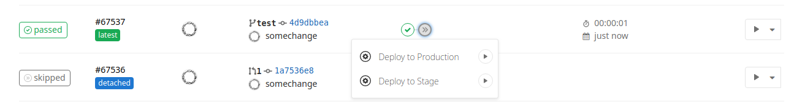
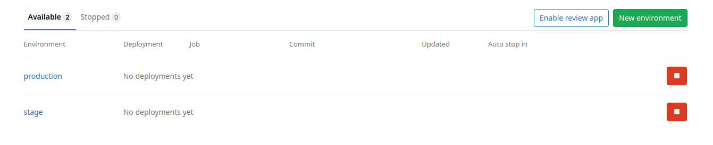

В первой главе мы покажем поэтапную сборку и деплой приложения без задействования внешних ресурсов таких как база данных и сборку ассетов.

Наше приложение будет состоять из одного docker образа собранного с помощью werf. Его единственной задачей будет вывод сообщения “hello world” по http.

В нашем случае будет работать процесс java, исполняющий собранный jar отдающий hello world по http.

Управлять маршрутизацией запросов к приложению будет Ingress в kubernetes кластере.

Мы реализуем два стенда: production и staging. В рамках hello world приложения мы предполагаем, что разработка ведётся локально, на вашем компьютере.

_В ближайшее время werf реализует удобные инструменты для локальной разработки, следите за обновлениями._

<a href="hello-world-local" />

## Локальная сборка

Поскольку собирать мы будем spring-фреймворк - для скачивания шаблона приложения перейдем на start.spring.io. Для простоты оставляем все поля как есть, справа добавляем в dependencies только "Spring Web" и нажмем generate. Разархивируем полученный архив - получим готовую структуру папок и нужные нам файлы для того чтобы описать простейшее приложение.
tree:

```
├── HELP.md
├── mvnw
├── mvnw.cmd
├── pom.xml
└── src
    ├── main
    │   ├── java
    │   │   └── com
    │   │       └── example
    │   │           └── demo
    │   │               └── DemoApplication.java
    │   └── resources
    │       └── application.properties
    └── test
        └── java
            └── com
                └── example
                    └── demo
                        └── DemoApplicationTests.java

12 directories, 7 files
```
[Можно посмотреть в репозитории](gitlab-java-springboot-files/00-demo/)


pom.xml у нас сгенерирован автоматически, в нем правки не нужны.
application.properties на данном этапе так же оставим пустым.
А вот в DemoApplication.java чуть допишем код, чтобы приложение по http отвечало Hello World:

```java
...
import org.springframework.web.bind.annotation.RequestMapping;
import org.springframework.web.bind.annotation.RestController;


@SpringBootApplication
@RestController
public class DemoApplication {

        @RequestMapping("/")
        public String home() {
                return "Hello World";
        }
...
```
[DemoApplication.java](gitlab-java-springboot-files/00-demo/src/main/java/com/example/demo/DemoApplication.java)

И инициализируем здесь git-репозиторий (чуть ниже будет рассказано зачем)

```bash
git init
git add .
git commit -m 'initial commit'
```

Для того чтобы werf смогла начать работу с нашим приложением - необходимо в корне нашего репозитория создать файл werf.yaml в которым будут описаны инструкции по сборке. Для начала соберем образ локально не загружая его в registry чтобы разобраться с синтаксисом сборки.

С помощью werf можно собирать образы с используя Dockerfile или используя синтаксис, описанный в документации werf (мы называем этот синтаксис и движок, который этот синтаксис обрабатывает, stapel). Для лучшего погружения - соберем наш образ с помощью stapel.

Итак, начнём с самой главной секции нашего werf.yaml файла, которая должна присутствовать в нём **всегда**. Называется она [meta config section](https://werf.io/documentation/configuration/introduction.html#meta-config-section) и содержит всего два параметра.

```yaml
project: spring
configVersion: 1
```
[werf.yaml](gitlab-java-springboot-files/00-demo/werf.yaml:1-2)

**_project_** - поле, задающее имя для проекта, которым мы определяем связь всех docker images собираемых в данном проекте. Данное имя по умолчанию используется в имени helm релиза и имени namespace в которое будет выкатываться наше приложение. Данное имя не рекомендуется изменять (или подходить к таким изменениям с должным уровнем ответственности) так как после изменений уже имеющиеся ресурсы, которые выкачаны в кластер, не будут переименованы.

**_configVersion_** - в данном случае определяет версию синтаксиса используемую в `werf.yaml`.

После мы сразу переходим к следующей секции конфигурации, которая и будет для нас основной секцией для сборки - [image config section](https://werf.io/documentation/configuration/introduction.html#image-config-section). И чтобы werf понял что мы к ней перешли разделяем секции с помощью тройной черты.


```yaml
project: spring
configVersion: 1
---
image: hello
from: maven:3-jdk-8
```

[werf.yaml](gitlab-java-springboot-files/00-demo/werf.yaml:1-5)


**_image_** задает короткое имя собираемого docker-образа. Должно быть уникально в рамках одного werf-файла.

**_from _** - аналогичная секция с обычным dockerfile. В примере spring используется `openjdk:8-jdk-alpine, `но он хорош для запуска, мы же воспользуемся образом в котором уже предустановлены все что необходимо maven для сборки - `maven:3-jdk-8.`

Теперь встает вопрос о том как нам добавить исходный код приложения внутрь нашего docker image. И для этого мы можем использовать Git! И нам даже не придётся устанавливать его внутрь docker image.

**_git_**, на наш взгляд это самый правильный способ добавления ваших исходников внутрь docker image, хотя существуют и другие. Его преимущество в том что он именно клонирует, и в дальнейшем накатывает коммитами изменения в тот исходный код что мы добавили внутрь нашего docker image, а не просто копирует файлы. Вскоре мы узнаем зачем это нужно.

```yaml
project: spring
configVersion: 1
---
image: hello
from: maven:3-jdk-8
git:
- add: /
  to: /app
```

[werf.yaml](gitlab-java-springboot-files/00-demo/werf.yaml:1-8)

Werf подразумевает что ваша сборка будет происходить внутри директории склонированного git репозитория. Потому мы списком можем указывать директории и файлы относительно корня репозитория которые нам нужно добавить внутрь image.

`add: /` - та директория которую мы хотим добавить внутрь docker image, мы указываем, что это весь наш репозиторий

`to: /app` - то куда мы клонируем наш репозиторий внутри docker image. Важно заметить что директорию назначения werf создаст сам.

 Есть возможность даже добавлять внешние репозитории внутрь проекта не прибегая к предварительному клонированию, как это сделать можно узнать [тут](https://werf.io/documentation/configuration/stapel_image/git_directive.html), но мы не рекомендуем такой подход.

Приступим к описанию того как происходит сама сборка.
Сейчас доступно 2 вида сборщика - shell и ansible. Первый аналогичен директиве RUN в dockerfile. Его удобнее использовать для быстрого получения результата с минимальными затратами времени на изучение. ansible более молодой инструмент и требующий несколько большего времени на изучение, но он позволяет получить более прогнозируемый результат вследствии декларативности. 
Пользовательские стадии - их всего 4 before install, install, before setup, setup и детально мы к ним вернемся в разделе управления зависимостями. Подробнее о них можно почитать в [документации](https://werf.io/documentation/configuration/stapel_image/assembly_instructions.html#usage-of-user-stages)

Однако, чтобы запускать jar его нужно предварительно собрать. Предлагается сделать это локально, мы же соберем jar так же используя werf и ansible-сборшик. Поскольку все системные зависимости для сборки удовлетворены - мы используем образ с maven и всеми зависимостями- опишем сборку приложения в стадии setup:

```yaml
project: spring
configVersion: 1
---
image: hello
from: maven:3-jdk-8
git:
- add: /
  to: /app
ansible:
  setup:
  - name: Build jar
    shell: |
      mvn -B -f pom.xml package dependency:resolve
    args:
      chdir: /app
      executable: /bin/bash
```

Уже сейчас можем запустить сборку и получить docker-образ с лежащим внутри jar.

Полный список поддерживаемых модулей ansible в werf можно найти [тут](https://werf.io/documentation/configuration/stapel_image/assembly_instructions.html#supported-modules).

Не забыв [установить werf](https://werf.io/documentation/guides/installation.html) локально, запускаем сборку с помощью [werf build](https://werf.io/documentation/cli/main/build.html)!

```bash
$  werf build --stages-storage :local
```


Вот и всё, наша сборка успешно завершилась. К слову если сборка падает и вы хотите изнутри контейнера её подебажить вручную, то вы можете добавить в команду сборки флаги:

```yaml
--introspect-before-error
```

или

```yaml
--introspect-error
```

Которые при падении сборки на одном из шагов автоматически откроют вам shell в контейнер, перед исполнением проблемной инструкции или после.

В конце werf отдал информацию о готовом image:


Теперь его можно запустить локально используя image_id просто с помощью docker.
Либо вместо этого использовать [werf run](https://werf.io/documentation/cli/main/run.html):


```bash
werf run --stages-storage :local --docker-options="-d -p 8080:8080 --restart=always" -- java -jar /app/target/demo-1.0.jar
```

Первая часть команды очень похожа на build, а во второй мы задаем [параметры](https://docs.docker.com/engine/reference/run/) docker и через двойную черту команду с которой хотим запустить наш image.

Небольшое пояснение про `--stages-storage :local `который мы использовали и при сборке и при запуске приложения. Данный параметр указывает на то где werf хранить стадии сборки. На момент написания статьи это возможно только локально, но в ближайшее время появится возможность сохранять их в registry.

Теперь наше приложение доступно локально на порту 8080:


На этом часть с локальным использованием werf мы завершаем и переходим к той части для которой werf создавался, использовании его в CI.

<a name="hello-world-ci" />

## Построение CI-процесса

После того как мы закончили со сборкой, которую можно производить локально, мы приступаем к базовой настройке CI/CD на базе Gitlab.

Начнем с того что добавим нашу сборку в CI с помощью .gitlab-ci.yml, который находится внутри корня проекта. Нюансы настройки CI в Gitlab можно найти [тут](https://docs.gitlab.com/ee/ci/).

Мы предлагаем простой флоу, который мы называем [fast and furious](https://docs.google.com/document/d/1a8VgQXQ6v7Ht6EJYwV2l4ozyMhy9TaytaQuA9Pt2AbI/edit#). Такой флоу позволит вам осуществлять быструю доставку ваших изменений в production согласно методологии GitOps и будут содержать два окружения, production и stage.

На стадии сборки мы будем собирать образ с помощью werf и загружать образ в registry, а затем на стадии деплоя собрать инструкции для kubernetes, чтобы он скачивал нужные образы и запускал их.

<a name="hello-world-ci-build" />

### Сборка в Gitlab CI

Для того, чтобы настроить CI-процесс создадим .gitlab-ci.yaml в корне репозитория.

Инициализируем werf перед запуском основной команды. Это необходимо делать перед каждым использованием werf поэтому мы вынесли в секцию `before_script`
Такой сложный путь с использованием multiwerf нужен для того, чтобы вам не надо было думать про обновление верфи и установке новых версий — вы просто указываете, что используете, например, use 1.1 stable и пребываете в уверенности, что у вас актуальная версия с закрытыми issues.

```yaml
before_script:
  - type multiwerf && source <(multiwerf use 1.1 stable)
  - type werf && source <(werf ci-env gitlab --verbose)
```

`werf ci-env gitlab --verbose` - готовит наш werf для работы в Gitlab, выставляя для этого все необходимые переменные.
Пример переменных автоматически выставляемых этой командой:

```bash
### DOCKER CONFIG
 export DOCKER_CONFIG="/tmp/werf-docker-config-832705503"
 ### STAGES_STORAGE
 export WERF_STAGES_STORAGE="registry.gitlab-example.com/chat/stages"
 ### IMAGES REPO
 export WERF_IMAGES_REPO="registry.gitlab-example.com/chat"
 export WERF_IMAGES_REPO_IMPLEMENTATION="gitlab"
 ### TAGGING
 export WERF_TAG_BY_STAGES_SIGNATURE="true"
 ### DEPLOY
 # export WERF_ENV=""
 export WERF_ADD_ANNOTATION_PROJECT_GIT="project.werf.io/git=https://lab.gitlab-example.com/chat"
 export WERF_ADD_ANNOTATION_CI_COMMIT="ci.werf.io/commit=61368705db8652555bd96e68aadfd2ac423ba263"
 export WERF_ADD_ANNOTATION_GITLAB_CI_PIPELINE_URL="gitlab.ci.werf.io/pipeline-url=https://lab.gitlab-example.com/chat/pipelines/71340"
 export WERF_ADD_ANNOTATION_GITLAB_CI_JOB_URL="gitlab.ci.werf.io/job-url=https://lab.gitlab-example.com/chat/-/jobs/184837"
 ### IMAGE CLEANUP POLICIES
 export WERF_GIT_TAG_STRATEGY_LIMIT="10"
 export WERF_GIT_TAG_STRATEGY_EXPIRY_DAYS="30"
 export WERF_GIT_COMMIT_STRATEGY_LIMIT="50"
 export WERF_GIT_COMMIT_STRATEGY_EXPIRY_DAYS="30"
 export WERF_STAGES_SIGNATURE_STRATEGY_LIMIT="-1"
 export WERF_STAGES_SIGNATURE_STRATEGY_EXPIRY_DAYS="-1"
 ### OTHER
 export WERF_LOG_COLOR_MODE="on"
 export WERF_LOG_PROJECT_DIR="1"
 export WERF_ENABLE_PROCESS_EXTERMINATOR="1"
 export WERF_LOG_TERMINAL_WIDTH="95"
```


Многие из этих переменных интуитивно понятны, и содержат базовую информацию о том где находится проект, где находится его registry, информацию о коммитах. \
Подробную информацию о конфигурации ci-env можно найти [тут](https://werf.io/documentation/reference/plugging_into_cicd/overview.html). От себя лишь хочется добавить, что если вы используете совместно с Gitlab внешний registry (harbor,Docker Registry,Quay etc.), то в команду билда и пуша нужно добавлять его полный адрес (включая путь внутри registry), как это сделать можно узнать [тут](https://werf.io/documentation/cli/main/build_and_publish.html). И так же не забыть первой командой выполнить [docker login](https://docs.docker.com/engine/reference/commandline/login/).

В рамках статьи нам хватит значений выставляемых по умолчанию.

Переменная [WERF_STAGES_STORAGE](https://ru.werf.io/documentation/reference/stages_and_images.html#%D1%85%D1%80%D0%B0%D0%BD%D0%B8%D0%BB%D0%B8%D1%89%D0%B5-%D1%81%D1%82%D0%B0%D0%B4%D0%B8%D0%B9) указывает где werf сохраняет свой кэш (стадии сборки) У werf есть опция распределенной сборки, про которую вы можете прочитать в нашей статье, в текущем примере мы сделаем по-простому и сделаем сборку на одном узле в один момент времени.


```yaml
variables:
    WERF_STAGES_STORAGE: ":local"
```
Дело в том что werf хранит стадии сборки раздельно, как раз для того чтобы мы могли не пересобирать весь образ, а только отдельные его части.

Плюс стадий в том, что они имеют собственный тэг, который представляет собой хэш содержимого нашего образа. Тем самым позволяя полностью избегать не нужных пересборок наших образов. Если вы собираете ваше приложение в разных ветках, и исходный код в них различается только конфигами которые используются для генерации статики на последней стадии. То при сборке образа одинаковые стадии пересобираться не будут, будут использованы уже собранные стадии из соседней ветки. Тем самым мы резко снижаем время доставки кода.

Основная команда на текущий момент - это werf build-and-publish, которая запускает сборку и публикацию в registry на gitlab runner с тегом werf для любой ветки. Путь до registry и другие параметры беруться верфью автоматически их переменных окружения gitlab ci.

```yaml
Build:
  stage: build
  script:
    - werf build-and-publish
  tags:
    - werf
```

Если вы всё правильно сделали и корректно настроен registry и gitlab ci — вы увидите собранный образ в registry. При использовании registry от gitlab — собранный образ можно увидеть через веб-интерфейс гитлаба.

Следующие параметры тем кто работал с гитлаб уже должны быть знакомы.

**_tags_** - нужен для того чтобы выбрать наш раннер, на который мы навесили этот тэг. В данном случае наш gitlab-runner в Gitlab имеет тэг werf

```yaml
  tags:
    - werf
```

Теперь мы можем запушить наши изменения и увидеть что наша стадия успешно выполнилась.


Лог в Gitlab будет выглядеть так же как и при локальной сборке, за исключением того что в конце мы увидим как werf пушит наш docker image в registry.

```
│ ┌ Publishing image hello by stages-signature tag 3a35e5ff158514066abadb0012e2fe0f19551902fa0355064aeb4cf7
│ ├ Info
│ │   images-repo: registry.example.com/demo/hello
│ │         image: registry.example.com/demo/hello:3a35e5ff158514066abadb0012e2fe0f19551902fa0355064aeb4cf7
│ └ Publishing image hello by stages-signature tag 3a35e5ff158514066abadb0012e2fe0f19551902fa0355064aeb4cf7 (27.23 seconds)
└ ⛵ image hello (27.32 seconds)

```

<a name="hello-world-ci-deploy" />

### Деплой в Kubernetes

Werf использует встроенный Helm для применения конфигурации в Kubernetes. Для описания объектов Kubernetes werf использует конфигурационные файлы Helm: шаблоны и файлы с параметрами (например, values.yaml). Помимо этого, werf поддерживает дополнительные файлы, такие как файлы c секретами и с секретными значениями (например secret-values.yaml), а также дополнительные Go-шаблоны для интеграции собранных образов.

Werf (по аналогии с helm) берет yaml шаблоны, которые описывают объекты Kubernetes, и генерирует из них общий манифест. Манифест отдается API Kubernetes, который на его основе внесет все необходимые изменения в кластер. Werf отслеживает как Kubernetes вносит изменения и сигнализирует о результатах в реальном времени. Все это благодаря встроенной в werf библиотеке [kubedog](https://github.com/flant/kubedog).

Внутри Werf доступны команды для работы с Helm, например можно проверить как сгенерируется общий манифест в результате работы werf с шаблонами:

```bash
$ werf helm render
```

Аналогично, доступны команды [helm list](https://werf.io/documentation/cli/management/helm/list.html) и другие.

#### Общее про хельм-конфиги

На сегодняшний день [Helm](https://helm.sh/) один из самых удобных способов которым вы можете описать свой deploy в Kubernetes. Кроме возможности установки готовых чартов с приложениями прямиком из репозитория, где вы можете введя одну команду, развернуть себе готовый Redis, Postgres, Rabbitmq прямиком в Kubernetes, вы также можете использовать Helm для разработки собственных чартов с удобным синтаксисом для шаблонизации выката ваших приложений.

Потому для werf это был очевидный выбор использовать такую технологию.

Мы не будем вдаваться в подробности разработки yaml манифестов с помощью Helm для Kubernetes. Осветим лишь отдельные её части, которые касаются данного приложения и werf в целом. Если у вас есть вопросы о том как именно описываются объекты Kubernetes, советуем посетить страницы документации по Kubernetes с его [концептами](https://kubernetes.io/ru/docs/concepts/) и страницы документации по разработке [шаблонов](https://helm.sh/docs/chart_template_guide/) в Helm.

Нам понадобятся следующие файлы со структурой каталогов:


```
.helm (здесь мы будем описывать деплой)
├── templates (объекты kubernetes в виде шаблонов)
│   ├── deployment.yaml (основное приложение)
│   ├── ingress.yaml (описание для ingress)
│   └── service.yaml (сервис для приложения)
├── secret-values.yaml (файл с секретными переменными)
└── values.yaml (файл с переменными для параметризации шаблонов)
```

Подробнее читайте в [нашей статье](https://habr.com/ru/company/flant/blog/423239/) из серии про Helm.


#### Описание приложения в хельме

Для работы нашего приложения в среде Kubernetes понадобится описать сущности Deployment, Service, завернуть трафик на приложение, донастроив роутинг в кластере с помощью сущности Ingress. И не забыть создать отдельную сущность Secret, которая позволит нашему kubernetes пулить собранные образа из registry.

##### Запуск контейнера

Для того чтобы запустить наше собранное приложение нужно описать с какой командой будет запускаться контейнер, который мы пушнули в registry. В нашем случае это `java -jar jarfile.jar`. Возможно еще какие то опции java при запуске (debug, лимиты по памяти, к примеру). Так же нужно указать helm-у в каком контейнере все это запускать и где взять образ.
Так же проблемой является то, что при "пустых" коммитах или нерелевантных коммитах (пустой коммит, к примеру, или мы поправили только README), сборка образа не произойдет (этот момент мы чуть позже разберем, когда будем разбираться как оптимизировать сборку), но при деплое все равно будет произведен перезапуск контейнера, так как поменялся его tag.
В нашем же случае, werf умеет немного магии.

Команда запуска в deployment.yaml будет выглядеть так:

```
       command:
       - java
       - -jar
       - /app/target/demo-1.0.jar $JAVA_OPT
```

[deployment.yaml](gitlab-java-springboot-files/00-demo/.helm/templates/10-deployment.yaml:19-22)

Решение же остальных вышеозвученных проблем с image взвалим на werf и её механизм content-based-tagging. О том что это и зачем написана отдельная [статья](https://habr.com/ru/company/flant/blog/495112/). 
Очень вкратце - werf на основании содержимого образа и истории формирования коммита в git делает вывод - поменялся ли image и стоит ли выполнять перезапуск контейнера с ним. А так же проставляет политику скачивания образа в зависимости собирался образ из тега или из бранча. В случае с branch будет проставлен Always, так как имя образа может не поменяться, а вот его содержимое - да.
Для использования этого функционала воспользуемся следующей конструкцией, которую пропишем в deployment:

```yaml
{{ tuple "hello" . | include "werf_container_image" | indent 8 }}
```

[deployment.yaml](gitlab-java-springboot-files/00-demo/.helm/templates/10-deployment.yaml:18)

Стоит так же почитать пулную [документацию](https://ru.werf.io/documentation/reference/deploy_process/deploy_into_kubernetes.html#werf_container_image) по werf_container_image.
Не считая еще одной похоже констуркции, о которой пойдет речь в следующей главе, это обычный deployment, описание параметров которого можно найти в официальной документации по kubernetes.

##### Переменные окружения

Самой частой проблемой связанной с запуском приложения в кубернетес является не использование переменных окружения. Зачастую большая часть переменных, которые требуются приложению прописаны в стандатные для фреймворка места (в нашем случае - application.properties) как есть. Из-за этого появляется соблазн делать образ для каждого окружения отдельно. Мы же рекомендуем подход, что должен собираться один образ и для стейдж и для прод окружения. И для того чтобы это работало необходимо использовать в коде переменные окружения. А сейчас нам нужно эти переменные пробрасывать в контейнер. Для Java это могут быть такие переменные как, например, данные о подключении к БД - хосты, пользователи БД, пароли для различных внутренних и внешних сервисов.

Эти переменные мы параметризируем с помощью файла `values.yaml`.

Например вот так мы опишем что в production окружении мы будем использовать домен example.com, а во всех остальных (_default) - stage.example.com. Так же опишем, что в production нужно запускать приложение без опции --debug.

```yaml
---
app:
  java_opt:
    _default: "--debug"
    production: ""
  url:
    _default: stage.example.com
    prodiction: example.com
```

[values.yaml](gitlab-java-springboot-files/00-demo/.helm/values.yaml)

Переменные окружения так же используются для того, чтобы не перевыкатывать контейнеры, которые не менялись.

Werf закрывает ряд вопросов, связанных с перевыкатом контейнеров с помощью конструкции  [werf_container_env](https://ru.werf.io/documentation/reference/deploy_process/deploy_into_kubernetes.html#werf_container_env). Она возвращает блок с переменной окружения DOCKER_IMAGE_ID контейнера пода. Значение переменной будет установлено только если .Values.global.werf.is_branch=true, т.к. в этом случае Docker-образ для соответствующего имени и тега может быть обновлен, а имя и тег останутся неизменными. Значение переменной DOCKER_IMAGE_ID содержит новый ID Docker-образа, что вынуждает Kubernetes обновить объект.

```yaml
{{ tuple "hello" . | include "werf_container_env" | indent 8 }}
```

[deployment.yaml](gitlab-java-springboot-files/00-demo/.helm/templates/10-deployment.yaml:31)

Аналогично можно пробросить секретные переменные (пароли и т.п.) и у Верфи есть специальный механизм для этого. Но к этому вопросу мы вернёмся позже.

##### Логгирование

Важно понимать, что все логи какие возможно приложение должно писать в stdout. Запись логов в файл будет как менее удобна в диагностике возможных проблем так и сама по себе может привести к проблеме с заканчивающимся местом на ноде kubernetes. А это уже приведет к автоматической попытке kubernetes расчистить место - под переедет на другую ноду, в результате получим рестарт пода и потерю всех логов.
Так же из stdout (посредством лога на ноде kubernetes) мы можем забирать централизованно их в аггрегатор логов, например fluent-ом. Это потребует меньше настроек, так как stdout-логи подов лежат в одном месте для всех подов.
В случае с springboot приложение уже настроено на логирование в stdout по умолчанию, однако можно их донастроить, например переопределив уровень логирования в application.properties. Подробнее - в [документации](https://docs.spring.io/spring-boot/docs/2.1.1.RELEASE/reference/html/boot-features-logging.html).

##### Направление трафика на приложение

Для того чтобы запросы извне попали к нам в приложение нужно 
* открыть порт у пода
* привязать к поду сервис 
* и настроить Ingress, который выступает у нас в качестве балансера.

Если вы мало работали с Kubernetes — эта часть может вызвать у вас много проблем. Большинство тех, кто начинает работать с Kubernetes по невнимательности допускают ошибки при конфигурировании labels и затем занимаются долгой и мучительной отладкой.

Следует внимательно отнестись к соответствию полей labels и selector, так как именно по ним происходит связь внутри кластера kubernetes.

###### Проброс портов

Для того чтобы попадать в наше запущенное приложение нужно сказать kubernetes как найти его. Для этого существует объект [service](https://kubernetes.io/docs/concepts/services-networking/service/).

В service нужно в селекторе указать лейблы подов и порты на которые описываемый сервис должен отправлять трафик.

Связь между service и подом в deployment описана в блоке spec.

```yaml
spec:
  selector:
    app: {{ .Chart.Name | quote }}
```

[service.yaml](gitlab-java-springboot-files/00-demo/.helm/templates/20-service.yaml:6-8)

Selector описывает по каким label нужно искать нужный под (labels описан в deployment выше).

```yaml
 template:
   metadata:
     labels:
       app: {{ .Chart.Name | quote }}
```

[deployment.yaml](gitlab-java-springboot-files/00-demo/.helm/templates/10-deployment.yaml:11-14)

Объект service позволяет сопоставлять любой входящий port и targetPort, например входящий 80 и порт в контейнере 8080, в нашем случае они одинаковы и указаны оба для прозрачности. Спецификация же позволяет не указывать targetPort если он совпадает с port. Можно так же указать несколько портов, если это требуется приложению. Для простоты оставим один порт.

###### Роутинг на Ingress

Мы описали сервис и теперь можем направить внешний (по отношению к кластеру kubernetes) трафик в приложение. Для этого опишем [ingress](https://kubernetes.io/docs/concepts/services-networking/ingress/) - направим все запросы на корень домена в service описанный выше на порт 8080.

Для этого нужно будет указать набор правил роутинга: с какого домена, с какого пути, в какой сервис и на какой порт надо направлять трафик.

Домен будем задавать так
                       
```yaml
  - host: {{ pluck .Values.global.env .Values.app.url | first | default .Values.app.url._default }}
```

[ingress.yaml](gitlab-java-springboot-files/00-demo/.helm/templates/90-ingress.yaml:10)

Здесь описан выбор в values.yaml url для нашего приложения в зависимости от окружения. Либо будет взят url для явно указанного в values.yaml окружения (например, production), либо будет взять _default значение. Как это выглядит можно посмотреть выше в главе "Переменные окружения".

Для каждого домена могут существовать набор правил для разных путей (location в терминах nginx). В нашем примере

```yaml
      - path: /
        backend:
          serviceName: {{ .Chart.Name | quote }}
          servicePort: 8080
```

[ingress.yaml](gitlab-java-springboot-files/00-demo/.helm/templates/90-ingress.yaml:13-16)

мы направляем все что пришло на корень домена в сервис "spring" (напомню, что это в случае с werf - поле project в werf.yaml) на порт сервиса 8080. Дальше уже с трафиком разбирается service.

#### Секретные переменные

Мы уже рассказывали о том как использовать обычные переменные в нашем СI забирая их напрямую из values.yaml. Суть работы с секретными переменными абсолютно та же, единственное что в репозитории они будут храниться в зашифрованном виде.

Потому для хранения в репозитории паролей, файлов сертификатов и т.п., рекомендуется использовать подсистему работы с секретами werf.

Идея заключается в том, что конфиденциальные данные должны храниться в репозитории вместе с приложением в зашифрованном виде, и должны оставаться независимыми от какого-либо конкретного сервера.

Для того, чтобы начать пользоваться секретными переменными нужно сгенерировать секретный ключ с которым werf сможет его шифровать и расшифровывать во время деплоя.
Делается это из консоли:

```bash
$ werf helm secret generate-secret-key
4710f841e17fabcc85f976e4a665ff9e
```

Чтобы им воспользоваться нужно добавить его либо в свои переменные окружения, либо записать в файл .werf_secret_key. Во втором случае нужно обязательно добавить его в gitignore.

```bash
export WERF_SECRET_KEY=4710f841e17fabcc85f976e4a665ff9e
echo $WERF_SECRET_KEY > .werf_secret_key
```

Теперь добавим секретную перменную, например, password:

```bash
werf helm secret values edit .helm/secret-values.yaml
```

Откроется редактор по умолчанию (согласно перменной EDITOR), куда мы впишем наши парои plain-text в формате аналогичном values.yaml. Например:

```yaml
app:
  password:
    _default: my-secret-password
    production: my-super-secret-password
```

При просмотре результирующего файла увидим лишь такое:

```yaml
app:
  password:
    _default: 10006755d101c5243fc400ababd7358689a921c19ee7e96a95f0ab82d46e4424573ab50ba666fcf5ce5e5dbd2b696c7706cf
    production: 1000bcd51061ebd1b2c2990041d30783be607b3a0aec8890c098f17bc96dc43e93765219651d743c7a37fb7361c10b703c7b
```

[secret-values.yaml](gitlab-java-springboot-files/00-demo/.helm/secret-values.yaml)

И в таком виде уже безопасно хранить пароли в git.
Для того чтобы отредактировать значение нужно снова воспользоваться командой

```bash
werf helm secret values edit .helm/secret-values.yaml
```

Для дальнейшего его использования - для деплоя приложения - в рамках gitlab нужно ключ WERF_SECRET_KEY положить в gitlab variables для проекта (Settings -> CI/CD -> variables). Оттуда werf при запуске получит эту перменную и сформирует корректный helm-chart с расшифрованным паролем.

#### Деплой в Gitlab CI

Опишем деплой приложения в Kubernetes. Деплой будет осуществляться на два стенда: staging и production.

Выкат на два стенда отличается только параметрами, поэтому воспользуемся шаблонами. Опишем базовый деплой, который потом будем кастомизировать под стенды: 

```yaml
.base_deploy: &base_deploy
  script:
    - werf deploy --stages-storage :local
  dependencies:
    - Build
  tags:
    - werf
```

Выкат, например, на Staging, будет выглядеть так: 
 
 ```yaml
 Deploy to Stage:
   extends: .base_deploy
   stage: deploy
   environment:
     name: stage
   except:
     - schedules
   only:
     - merge_requests
   when: manual
```

Нет необходимости пробрасывать переменные окружения, создаваемые GitLab CI — этим занимается Werf. Достаточно только указать название стенда

```yaml
environment:
     name: stage
```

_Обратите внимание: домены каждого из стендов указываются в helm-шаблонах._

_Остальные настройки подробно описывать не будем, разобраться в них можно с [помощью документации Gitlab](https://docs.gitlab.com/ce/ci/yaml/)_

После описания стадий выката при создании Merge Request и будет доступна кнопка Deploy to Stage.


Посмотреть статус выполнения pipeline можно в интерфейсе gitlab **CI / CD - Pipelines**



Список всех окружений - доступен в меню **Operations - Environments**



Из этого меню - можно так же быстро открыть приложение в браузере.


Здесь будет подставлен домен, который указывается в секции environment рядом с `name:`

```yaml
   environment:
     name: stage
     url: http://stage.example.com
```

К тому как использовать эту переменную в helm-чарте мы вернемся в самом конце, а пока что для простоты будем использовать .helm/values для объявления доменов.

