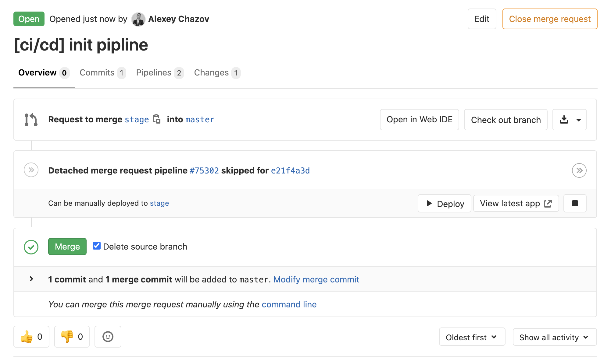
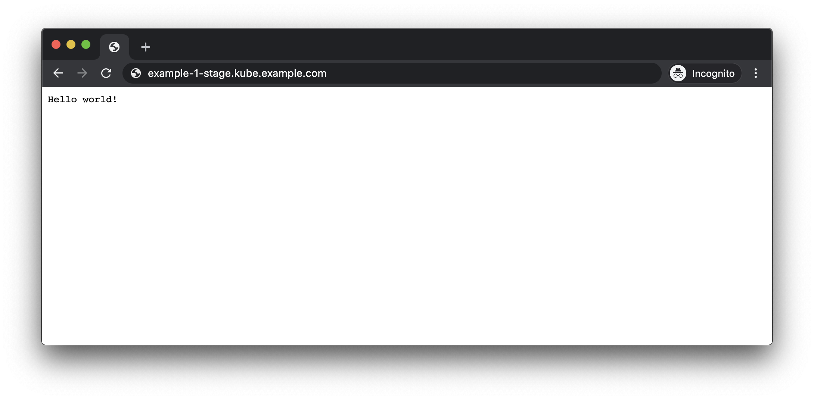

# Введение

Рассмотрим разные способы которые помогут ruby on rails программисту собрать приложение и запустить его в kubernetes кластере.

Предполагается что читатель имеет базовые знания в разработке на ruby on rails а также немного знаком с Gitlab CI и примитивами kubernetes, либо готов во всём этом разобраться самостоятельно. Мы постараемся предоставить все ссылки на необходимые ресурсы, если потребуется приобрести какие то новые знания.

Собирать приложения будем с помощью werf. Данный инструмент работает в Linux MacOS и Windows, инструкция по [установке](https://ru.werf.io/documentation/guides/installation.html) находится на официальном [сайте](https://ru.werf.io/). В качестве примера - также приложим Docker файлы.

Для иллюстрации действий в данной статье - создан репозиторий с исходным кодом, в котором находятся несколько простых приложений. Мы постараемся подготовить примеры чтобы они запускались на вашем стенде и постараемся подсказать, как отлаживать возможные проблемы при вашей самостоятельной работе.


## Подготовка приложения

Наилучшим образом приложения будут работать в Kubernetes - если они соответствуют [12 факторам heroku](https://12factor.net/). Благодаря этому - у нас в kubernetes работают stateless приложения, которые не зависят от среды. Это важно, так как кластер может самостоятельно переносить приложения с одного узла на другой, заниматься масштабированием и т.п. — и мы не указываем, где конкретно запускать приложение, а лишь формируем правила, на основании которого кластер принимает свои собственные решения.

Договоримся что наши приложения соответствуют этим требованиям. На хабре уже было описание данного подхода, вы можете почитать про него например [тут](https://12factor.net/).


## Подготовка и настройка среды

Для того, чтобы пройти по этому гайду, необходимо, чтобы

*   У вас был работающий и настроенный Kubernetes кластер
*   Код приложения находился в Gitlab
*   Был настроен Gitlab CI, подняты и подключены к нему раннеры

Для пользователя под которым будет производиться запуск runner-а - нужно установить multiwerf - данная утилита позволяет переключаться между версиями werf и автоматически обновлять его. Инструкция по установке - доступна по [ссылке](https://ru.werf.io/documentation/guides/installation.html#installing-multiwerf).

Для автоматического выбора актуальной версии werf в канале stable, релиз 1.1 выполним следующую  команду:

```
. $(multiwerf use 1.1 stable --as-file)
```

Перед деплоем нашего приложения необходимо убедиться что наша инфраструктура готова к тому чтобы использовать werf. Используя [инструкцию](https://ru.werf.io/documentation/guides/gitlab_ci_cd_integration.html#%D0%BD%D0%B0%D1%81%D1%82%D1%80%D0%BE%D0%B9%D0%BA%D0%B0-runner) по подготовке к использованию Werf в Gitlab CI, вам нужно убедиться что все следующие пункты выполнены:

*   Развернут отдельный сервер с сетевой доступностью до мастер ноды Kubernetes.
*   На данном сервере установлен gitlab-runner.
*   Gitlab-runner подключен к нашему Gitlab с тегом werf в режиме shell executor.
*   Ранеры включены и активны для репозитория с нашим приложением.
*   Для пользователя, которого использует gitlab-runner и под которым запускается сборка и деплой, установлен kubectl и добавлен конфигурационный файл для подключения к kubernetes.
*   Для gitlab включен и настроен gitlab registry
*   Gitlab-runner имеет доступ к API kubernetes и запускается по тегу werf


# Hello world

В первой главе мы покажем поэтапную сборку и деплой приложения без задействования внешних ресурсов таких как база данных и сборку ассетов.

Наше приложение будет состоять из одного docker образа собранного с помощью werf. Его единственной задачей будет вывод сообщения “hello world” по http.

В этом образе будет работать один основной процесс который запустит веб сервер для ruby.

Управлять маршрутизацией запросов к приложению будет управлять Ingress в kubernetes кластере.

Мы реализуем два стенда: [production](https://ru.werf.io/documentation/reference/ci_cd_workflows_overview.html#production) и [staging](https://ru.werf.io/documentation/reference/ci_cd_workflows_overview.html#staging).

_В ближайшее время werf реализует удобные инструменты для локальной разработки, следите за обновлениями._


## Локальная сборка

Исходный код приложений выложен на [Github](gitlab-rails-files/examples)

Для того чтобы werf смог начать работу с нашим приложением - необходимо в корне нашего репозитория создать файл werf.yaml в которым будут описаны инструкции по сборке. Для начала соберем образ локально не загружая его в registry чтобы разобраться с синтаксисом сборки.

С помощью werf можно собирать образы с использованием Dockerfile или stapel (альтернативный сборщик с описанием сборки в yaml, поддержкой ansible, инкрементальными пересборками на основе git и др. фичами). Для лучшего погружения — соберем наш образ с помощью stapel.

Итак, начнём werf.yaml с обязательной [секции мета-информации]({{ site.baseurl }}/documentation/configuration/introduction.html#секция-мета-информации):

[werf.yaml](gitlab-rails-files/examples/example_1/werf.yaml):
```yaml
project: example-1
configVersion: 1
```

**_project_** - поле, задающее имя для проекта, которым мы определяем связь всех docker images собираемых в данном проекте. Данное имя по умолчанию используется в имени helm релиза и имени namespace в которое будет выкатываться наше приложение. Данное имя не рекомендуется изменять (или подходить к таким изменениям с должным уровнем ответственности) так как после изменений уже имеющиеся ресурсы, которые выкачаны в кластер, не будут переименованы.

**_configVersion_** - в данном случае определяет версию синтаксиса используемую в `werf.yaml`.

После мы сразу переходим к следующей секции конфигурации, которая и будет для нас основной секцией для сборки - [image config section](https://werf.io/documentation/configuration/introduction.html#image-config-section). И чтобы werf понял что мы к ней перешли разделяем секции с помощью тройной черты.


```yaml
project: example-1
configVersion: 1
---
image: rails
from: ruby:2.7.1
```

В строке `image: rails` дано название для нашего собранного образа. Данное имя мы впоследствии будем указывать при запуске контейнера. Строка `from: ruby:2.7.1` определяет что будет взято за основу, мы берем официальный публичный образ с нужной нам версией ruby.

Теперь встает вопрос о том как нам добавить исходный код приложения внутрь нашего docker image. И для этого мы можем использовать Git! И нам даже не придётся устанавливать его внутрь docker image.


```yaml
project: example-1
configVersion: 1
---
image: rails
from: ruby:2.7.1
git:
- add: /
  to: /app
```

Использование директивы **_git_** — это, на наш взгляд, самый правильный способ добавления исходников внутрь docker image, хотя существуют и другие. Как такового репозитория в образе не создаётся, директория .git отсутствует. На одном из первых этапов сборки все исходники пакуются в архив (с учётом всех пользовательских параметров) и распаковываются внутри контейнера. При последующих сборках накладываются патчи с разницей.

При использовании директивы `git`, werf использует репозиторий проекта, в котором расположен `werf.yaml`. Добавляемые директории и файлы проекта указываются списком относительно корня репозитория.

`add: /` - та директория которую мы хотим добавить внутрь docker image, мы указываем, что это весь наш репозиторий

`to: /app` - то куда мы клонируем наш репозиторий внутри docker image. Важно заметить что директорию назначения werf создаст сам.

Директива git также позволяет добавлять исходники из удалённых git-репозиториев, используя параметр `url` (детали и особенности можно почитать в [документации]({{ site.baseurl }}/documentation/configuration/stapel_image/git_directive.html#работа-с-удаленными-репозиториями)).

Следующим этапом необходимо описать правила сборки для приложения. Werf позволяет кэшировать сборку образа подобно слоям в docker, только с явным набором инструкций необходимых данном кэше. Этот сборочный этап - называется стадия. Мы рассмотрим более подробно возможности стадий в с следующих главах.
Для текущего приложения опишем 2 стадии в которых сначала устанавливаем необходимые завимимости для возможности сборки приложения а потом - непосредственно собираем приложение.
Команды описывающие сборку можно описывать в ansible формате или shell коммандами.
Добавим в werf.yaml следующий блок используя ansible синтаксис:

```yaml
ansible:
  beforeInstall:
  - name: install bundler
    shell: gem install bundler
  install:
  - name: bundle install
    shell: bundle config set without 'development test' && bundle install
    args:
      chdir: /app
```

Чтобы при запуске приложения по умолчанию использовалась дириктория `/app` - укажем необходимые docker переменные в `werf.yaml`

```yaml
docker:
  WORKDIR: /app
```

Полный список поддерживаемых модулей ansible в werf можно найти [тут](https://werf.io/documentation/configuration/stapel_image/assembly_instructions.html#supported-modules).

Не забыв [установить werf](https://werf.io/documentation/guides/installation.html) локально, запускаем сборку с помощью [werf build](https://werf.io/documentation/cli/main/build.html)!

```bash
$  werf build --stages-storage :local
```

```
...
│ ┌ Building stage rails/dockerInstructions
│ ├ Info
│ │     repository: werf-stages-storage/example-1
│ │       image_id: 2743bc56bbf7
│ │        created: 2020-05-26T22:44:26.0159982Z
│ │            tag: 7e691385166fc7283f859e35d0c9b9f1f6dc2ea7a61cb94e96f8a08c-1590533066068
│ │           diff: 0 B
│ │   instructions: WORKDIR /app
│ └ Building stage rails/dockerInstructions (0.82 seconds)
└ ⛵ image rails (239.56 seconds)
```

Вот и всё, наша сборка успешно завершилась. К слову если сборка падает и вы хотите изнутри контейнера её подебажить вручную, то вы можете добавить в команду сборки флаги:

```yaml
--introspect-before-error
```

или

```yaml
--introspect-error
```

Которые при падении сборки на одном из шагов автоматически откроют вам shell в контейнер, перед исполнением проблемной инструкции или после.

В конце werf отдал информацию о готовом image:

```
werf-stages-storage/example-1:7e691385166fc7283f859e35d0c9b9f1f6dc2ea7a61cb94e96f8a08c-1590533066068
```

Теперь его можно запустить локально используя image_id просто с помощью docker.
Либо вместо этого использовать [werf run](https://werf.io/documentation/cli/main/run.html):


```bash
werf run --stages-storage :local --docker-options="-d -p 3000:3000 --restart=always" -- bash -c "RAILS_MASTER_KEY=0f4b75104a5b3b7ea9c98cc644ec0fa4 RAILS_ENV=production bundle exec rails server -b 0.0.0.0"
```

Первая часть команды очень похожа на build, а во второй мы задаем [параметры](https://docs.docker.com/engine/reference/run/) docker и через двойную черту команду с которой хотим запустить наш image.

Небольшое пояснение про `--stages-storage :local `который мы использовали и при сборке и при запуске приложения. Данный параметр указывает на то где werf хранить стадии сборки.

Теперь наше приложение доступно локально на порту 3000:


На этом часть с локальным использованием werf мы завершаем и переходим к той части для которой werf создавался, использовании его в CI.

## Построение CI-процесса

После того как мы закончили со сборкой, которую можно производить локально, мы приступаем к базовой настройке CI/CD на базе Gitlab.

Начнем с того что добавим нашу сборку в CI с помощью .gitlab-ci.yml, который находится внутри корня проекта. Нюансы настройки CI в Gitlab можно найти [тут](https://docs.gitlab.com/ee/ci/).

Мы предлагаем простой флоу, который мы называем [fast and furious](https://docs.google.com/document/d/1a8VgQXQ6v7Ht6EJYwV2l4ozyMhy9TaytaQuA9Pt2AbI/edit#). Такой флоу позволит вам осуществлять быструю доставку ваших изменений в production согласно методологии GitOps и будут содержать два окружения, production и stage.

На стадии сборки мы будем собирать образ с помощью werf и загружать образ в registry, а затем на стадии деплоя собрать инструкции для kubernetes, чтобы он скачивал нужные образы и запускал их.

### Сборка в Gitlab CI

Для того, чтобы настроить CI-процесс создадим .gitlab-ci.yaml в корне репозитория.

Инициализируем werf перед запуском основной команды. Это необходимо делать перед каждым использованием werf поэтому мы вынесли в секцию `before_script`
Такой сложный путь с использованием multiwerf нужен для того, чтобы вам не надо было думать про обновление верфи и установке новых версий — вы просто указываете, что используете, например, use 1.1 stable и пребываете в уверенности, что у вас актуальная версия с закрытыми issues.

[.gitlab-ci.yml](gitlab-rails-files/examples/example_1/.gitlab-ci.yml#L8)
```yaml
before_script:
  - type multiwerf && source <(multiwerf use 1.1 stable)
  - type werf && source <(werf ci-env gitlab --verbose)
```

Практически все опции werf можно задавать переменными окружения. Команда ci-env проставляет предопределенные значения опций, которые будут использоваться всеми командами werf в shell-сессии, на основе переменных окружений CI:

```bash
### DOCKER CONFIG
export DOCKER_CONFIG="/tmp/werf-docker-config-832705503"
### STAGES_STORAGE
export WERF_STAGES_STORAGE="registry.gitlab-example.com/chat/stages"
### IMAGES REPO
export WERF_IMAGES_REPO="registry.gitlab-example.com/chat"
export WERF_IMAGES_REPO_IMPLEMENTATION="gitlab"
### TAGGING
export WERF_TAG_BY_STAGES_SIGNATURE="true"
### DEPLOY
# export WERF_ENV=""
export WERF_ADD_ANNOTATION_PROJECT_GIT="project.werf.io/git=https://lab.gitlab-example.com/chat"
export WERF_ADD_ANNOTATION_CI_COMMIT="ci.werf.io/commit=61368705db8652555bd96e68aadfd2ac423ba263"
export WERF_ADD_ANNOTATION_GITLAB_CI_PIPELINE_URL="gitlab.ci.werf.io/pipeline-url=https://lab.gitlab-example.com/chat/pipelines/71340"
export WERF_ADD_ANNOTATION_GITLAB_CI_JOB_URL="gitlab.ci.werf.io/job-url=https://lab.gitlab-example.com/chat/-/jobs/184837"
### IMAGE CLEANUP POLICIES
export WERF_GIT_TAG_STRATEGY_LIMIT="10"
export WERF_GIT_TAG_STRATEGY_EXPIRY_DAYS="30"
export WERF_GIT_COMMIT_STRATEGY_LIMIT="50"
export WERF_GIT_COMMIT_STRATEGY_EXPIRY_DAYS="30"
export WERF_STAGES_SIGNATURE_STRATEGY_LIMIT="-1"
export WERF_STAGES_SIGNATURE_STRATEGY_EXPIRY_DAYS="-1"
### OTHER
export WERF_LOG_COLOR_MODE="on"
export WERF_LOG_PROJECT_DIR="1"
export WERF_ENABLE_PROCESS_EXTERMINATOR="1"
export WERF_LOG_TERMINAL_WIDTH="95"
```


Многие из этих переменных интуитивно понятны, и содержат базовую информацию о том где находится проект, где находится его registry, информацию о коммитах. В рамках статьи нам хватит значений выставляемых по умолчанию.

Подробную информацию о конфигурации ci-env можно найти [тут](https://werf.io/documentation/reference/plugging_into_cicd/overview.html). Если вы используете GitLab CI/CD совместно с внешним docker registry (harbor, Docker Registry, Quay etc.), то в команду билда и пуша нужно добавлять его полный адрес (включая путь внутри registry), как это сделать можно узнать [тут](https://werf.io/documentation/cli/main/build_and_publish.html). И так же не забыть первой командой выполнить [docker login](https://docs.docker.com/engine/reference/commandline/login/).

Переменная [WERF_STAGES_STORAGE](https://ru.werf.io/documentation/reference/stages_and_images.html#%D1%85%D1%80%D0%B0%D0%BD%D0%B8%D0%BB%D0%B8%D1%89%D0%B5-%D1%81%D1%82%D0%B0%D0%B4%D0%B8%D0%B9) указывает где werf сохраняет стадии сборки (сборочный кэш). По умолчанию для GitLab CI/CD werf хранит стадии в docker registry, привязанном к GitLab CI/CD, по адресу `CI_REGISTRY_IMAGE/stages`. Используется распределённый режим работы werf, почитать о котором подробнее можно в статьях про [устройство стадий](https://ru.werf.io/documentation/reference/stages_and_images.html#%D1%85%D1%80%D0%B0%D0%BD%D0%B8%D0%BB%D0%B8%D1%89%D0%B5-%D1%81%D1%82%D0%B0%D0%B4%D0%B8%D0%B9) и [инструкции по переключению в распределённый режим](https://ru.werf.io/documentation/guides/switch_to_distributed_mode.html).

Дело в том что werf хранит стадии сборки раздельно, как раз для того чтобы мы могли не пересобирать весь образ, а только отдельные его части.

Плюс стадий в том, что они имеют собственный тэг, который представляет собой хэш, зависящий от содержимого нашего образа и истории изменений в git. Это позволяет избегать ненужных пересборок наших образов, но при этом обеспечивается изоляцию кеша между ветками. Подробнее об этом [читайте в руководстве](https://ru.werf.io/documentation/reference/stages_and_images.html#%D1%81%D1%82%D0%B0%D0%B4%D0%B8%D0%B8).

Основная команда на текущий момент - это werf build-and-publish, которая запускает сборку и публикацию в registry на gitlab runner с тегом werf для любой ветки. Путь до registry и другие параметры беруться верфью автоматически их переменных окружения gitlab ci.

```yaml
Build:
  stage: build
  script:
    - werf build-and-publish
  tags:
    - werf
```

Если вы всё правильно сделали и корректно настроен registry и gitlab ci — вы увидите собранный образ в registry. При использовании registry от gitlab — собранный образ можно увидеть через веб-интерфейс гитлаба.

Следующие параметры тем кто работал с гитлаб уже должны быть знакомы.

**_tags_** - нужен для того чтобы выбрать наш раннер, на который мы навесили этот тэг. В данном случае наш gitlab-runner в Gitlab имеет тэг werf

```yaml
  tags:
    - werf
```

Теперь мы можем запушить наши изменения и увидеть что наша стадия успешно выполнилась.


Лог в Gitlab будет выглядеть так же как и при локальной сборке, за исключением того что в конце мы увидим как werf пушит наш docker image в registry.

```
 │ ┌ Publishing image rails by stages-signature tag 72588513f1acf65c6436ab8d7e344964efd1fcf3 ...
 │ ├ Info
 │ │   images-repo: registry.example.com/alexey.chazov/example_1/rails
 │ │         image: registry.example.com/alexey.chazov/example_1/rails:72588513f1acf65c6436ab8d7 ↵
 │ │   e344964efd1fcf3ccefc07974decede
 │ └ Publishing image rails by stages-signature tag 72588513f1acf65c6436ab8d ... (13.34 seconds)
 └ ⛵ image rails (69.68 seconds)
```

### Деплой в Kubernetes

Werf использует встроенный Helm для применения конфигурации в Kubernetes. Для описания объектов Kubernetes werf использует конфигурационные файлы Helm: шаблоны и файлы с параметрами (например, values.yaml). Помимо этого, werf поддерживает дополнительные файлы, такие как файлы c секретами и с секретными значениями (например secret-values.yaml), а также дополнительные Go-шаблоны для интеграции собранных образов.

Werf (по аналогии с helm) берет yaml шаблоны, которые описывают объекты Kubernetes, и генерирует из них общий манифест. Манифест отдается API Kubernetes, который на его основе внесет все необходимые изменения в кластер. Werf отслеживает как Kubernetes вносит изменения и сигнализирует о результатах в реальном времени. Все это благодаря встроенной в werf библиотеке [kubedog](https://github.com/flant/kubedog).

Внутри Werf доступны команды для работы с Helm, например можно проверить как сгенерируется общий манифест в результате работы werf с шаблонами:

```bash
$ werf helm render
```

Аналогично, доступны команды [helm list](https://werf.io/documentation/cli/management/helm/list.html) и другие.

#### Общее про хельм-конфиги

На сегодняшний день [Helm](https://helm.sh/) один из самых удобных способов которым вы можете описать свой deploy в Kubernetes. Кроме возможности установки готовых чартов с приложениями прямиком из репозитория, где вы можете введя одну команду, развернуть себе готовый Redis, Postgres, Rabbitmq прямиком в Kubernetes, вы также можете использовать Helm для разработки собственных чартов с удобным синтаксисом для шаблонизации выката ваших приложений.

Потому для werf это был очевидный выбор использовать такую технологию.

Мы не будем вдаваться в подробности разработки yaml манифестов с помощью Helm для Kubernetes. Осветим лишь отдельные её части, которые касаются данного приложения и werf в целом. Если у вас есть вопросы о том как именно описываются объекты Kubernetes, советуем посетить страницы документации по Kubernetes с его [концептами](https://kubernetes.io/ru/docs/concepts/) и страницы документации по разработке [шаблонов](https://helm.sh/docs/chart_template_guide/) в Helm.

Нам понадобятся следующие файлы со структурой каталогов:


```
.helm (здесь мы будем описывать деплой)
├── templates (объекты kubernetes в виде шаблонов)
│   ├── deployment.yaml (основное приложение)
│   ├── ingress.yaml (описание для ingress)
│   └── service.yaml (сервис для приложения)
├── secret-values.yaml (файл с секретными переменными)
└── values.yaml (файл с переменными для параметризации шаблонов)
```

Подробнее читайте в [нашей статье](https://habr.com/ru/company/flant/blog/423239/) из серии про Helm.

#### Описание приложения в хельме

Для работы нашего приложения в среде Kubernetes понадобится описать сущности Deployment, Service, завернуть трафик на приложение, донастроив роутинг в кластере с помощью сущности Ingress. И не забыть создать отдельную сущность Secret, которая позволит нашему kubernetes пулить собранные образа из registry.

##### Запуск контейнера

Нам нужно указать какой процесс будет запускаться в контейнере и на основании какого образа.

[.helm/templates/deployment.yaml](gitlab-rails-files/examples/example_1/.helm/templates/deployment.yaml#L17)
```yaml
      containers:
      - name: rails
        command: ["bundle", "exec", "rails", "server", "-b", "0.0.0.0"]
{{ tuple "rails" . | include "werf_container_image" | indent 8 }}
```

Указываем команду запуска для контейнера — это стандартный синтаксис хельма

Функция `{{ tuple "rails" . | include "werf_container_image"}}` которая подставит необходимый нам образ с приложением.
Данная функция генерирует ключи image и imagePullPolicy со значениями, необходимыми для соответствующего контейнера пода.
Особенность функции в том, что значение imagePullPolicy формируется исходя из значения .Values.global.werf.is_branch. Если не используется тег, то функция возвращает imagePullPolicy: Always, иначе (если используется тег) — ключ imagePullPolicy не возвращается. В результате образ будет всегда скачиваться если он был собран для git-ветки, т.к. у Docker-образа с тем же именем мог измениться ID.
Функция может возвращать несколько строк, поэтому она должна использоваться совместно с конструкцией indent. Подробнее - можно посмотреть в [документации](https://ru.werf.io/documentation/reference/deploy_process/deploy_into_kubernetes.html#werf_container_image).

##### Переменные окружения

Для корректной работы нашего приложения ему нужно узнать переменные окружения.

Для ruby on rails это, например, `RAILS_ENV` в которой указывается окружение.
Так же нужно добавить переменную `RAILS_MASTER_KEY` которая расшифровывает секретные значения, это стандартный механизм ruby on rails.

И эти переменные можно параметризовать с помощью файла `values.yaml` или в файле с деплойментом.

Добавим переменные окружения в файл с деплойментом, явно указав значение переменной и значение из файла `values.yaml`.

[.helm/templates/deployment.yaml](gitlab-rails-files/examples/example_1/.helm/templates/deployment.yaml#L21)
```yaml
      env:
      - name: RAILS_MASTER_KEY
        value: {{ .Values.rails.master_key}}
      - name: RAILS_ENV
        value: production
```

При деплое `{{ .Values.rails.master_key}}` шаблон будет заменен значением из файла `values.yaml`, это так же стандартный механизм `helm`.

Переменные окружения иногда используются для того, чтобы не перевыкатывать контейнеры, которые не менялись.

Werf закрывает ряд вопросов, связанных с перевыкатом контейнеров с помощью конструкции  [werf_container_env](https://ru.werf.io/documentation/reference/deploy_process/deploy_into_kubernetes.html#werf_container_env). Она возвращает блок с переменной окружения DOCKER_IMAGE_ID контейнера пода. Значение переменной будет установлено только если .Values.global.werf.is_branch=true, т.к. в этом случае Docker-образ для соответствующего имени и тега может быть обновлен, а имя и тег останутся неизменными. Значение переменной DOCKER_IMAGE_ID содержит новый ID Docker-образа, что вынуждает Kubernetes обновить объект.

```yaml
{{ tuple "rails" . | include "werf_container_env" | indent 8 }}
```

Аналогично можно пробросить секретные переменные (пароли и т.п.) и у Верфи есть специальный механизм для этого. Но к этому вопросу мы вернёмся позже.

##### Логгирование

При запуске приложения в kubernetes необходимо логи отправлять в stdout и stderr - это необходимо для простого сбора логов например через `filebeat`, а так же чтобы не разростались docket образы запущенных приложений.
Для того чтобы логи приложения отправлялись в stdout нам необходимо будет добавить переменную окружения `RAILS_LOG_TO_STDOUT="true" `согласно [изменениям](https://github.com/rails/rails/pull/23734) в rails framework.

```yaml
      - name: RAILS_LOG_TO_STDOUT
        value: "true"
```

##### Направление трафика на приложение

Для того чтобы запросы извне попали к нам в приложение нужно открыть порт у пода, привязать к поду сервис и настроить Ingress, который выступает у нас в качестве балансера.

Если вы мало работали с Kubernetes — эта часть может вызвать у вас много проблем. Большинство тех, кто начинает работать с Kubernetes по невнимательности допускают ошибки при конфигурировании labels и затем занимаются долгой и мучительной отладкой.


###### Проброс портов

При запуске - приложение работает на стандартном порту `3000`
Описание порта который будет доступен через сервис.


```yaml
        ports:
        - containerPort: 3000
          name: http
          protocol: TCP
```

В файле `.helm/templates/service.yaml` описан сервис через который будет доступно наше приложение.

Порт и сервис нам очень нужны и важны, так как именно на них мы будем отправлять запросы, когда будем конфигурировать ingrss.

[.helm/templates/service.yaml](gitlab-rails-files/examples/example_1/.helm/templates/service.yaml)
```yaml
---
apiVersion: v1
kind: Service
metadata:
  name: {{ .Chart.Name }}
spec:
  selector:
    service: {{ .Chart.Name }}
  ports:
  - name: http
    port: 3000
    protocol: TCP

```

При описании сервиса - нужно правильно указать селектор деплоймента иначе запросы не будут приходить на приложение.

###### Роутинг на Ingress

{{ TODO вводная и человеческое описание того, что происходит}}

Создадим ingress `.helm/templates/ingress.yaml `для нашего `kubernetes.io/ingress.class.`

_Тут есть коллизия терминов “ингресс” - в смысле приложение-балансировщик, которое работает в кластере и принимает входящие извне запросы и “Ингресс” в смысле аннотация, которую мы скармливаем кубернетесу, чтобы он настроил ингресс-приложение. Смиритесь, разбирайтесь по контексту._

[.helm/templates/ingress.yaml](gitlab-rails-files/examples/example_1/.helm/templates/ingress.yaml)
```yaml
  rules:
  - host: {{ .Values.global.ci_url }}
    http:
      paths:
      - path: /
        backend:
          serviceName: {{ .Chart.Name }}
          servicePort: 3000
```

Обратите внимание на параметр {{ .Values.global.ci_url }}. Данный параметр передается из файла .gitlab-ci.yml

[.gitlab-ci.yml](gitlab-rails-files/examples/example_1/.gitlab-ci.yml#L21)
```yaml
.base_deploy:
  script:
    - werf deploy
      --set "global.ci_url=example.com"
```

Описание файла `.gitlab-ci.yml` мы рассмотрим позже

Подобным образом, можно передавать и другие необходимые переменные.

#### Секретные переменные

Ruby on rails позволяет шифровать переменные. Это разрешает сохранять любые учетные данные аутентификации для сторонних сервисов напрямую в репозиторий, зашифрованный с помощью ключа в файле `config/master.key` или переменной среды `RAILS_MASTER_KEY`

Для хранения в репозитории паролей, файлов сертификатов и т.п., рекомендуется использовать подсистему работы с секретами werf.

Идея заключается в том, что конфиденциальные данные должны храниться в репозитории вместе с приложением в зашифрованном виде, и должны оставаться независимыми от какого-либо конкретного сервера.

Для работы нашего приложения потребуется `RAILS_MASTER_KEY` с помощью которого происходит шифрование секретов и оно необходимо в production окружении. Данную переменную окружения мы уже указали в деплойменете нашего приложения в строке 24. Все секретные данные нужно описывать в зашифрованом файле `.helm/secret-values.yaml`.


Подстановка значений из этого файла происходит при рендере шаблона, который также запускается при деплое.

Для создания зашифрованных данных нам необходимо сгенерировать ключ.

```bash
$ werf helm secret generate-secret-key
504a1a2b17042311681b1551aa0b8931
```

После генерации ключа - необходимо указать его в переменных окружения или в файле в корне нашего приложения

```bash
$ export WERF_SECRET_KEY=504a1a2b17042311681b1551aa0b8931
OR
$ echo 504a1a2b17042311681b1551aa0b8931 > .werf_secret_key
```

Теперь можем редактировать наши секретные переменные:

```bash
$ werf helm secret values edit .helm/secret-values.yaml
```

Откроется текстовый редактор который указан в `$EDITOR` или vim по умолчанию.
После шифрования наш файл будет выглядеть следующем образом:

[.helm/secret-values.yaml](gitlab-rails-files/examples/example_1/.helm/secret-values.yaml)
```yaml
rails:
  master_key: 100083f330adfb9e13fff74c9ab71b93ed77704aca3a0c607679336e099d48977d6565b314c06b8ad7aefc9d8d90629e92d851b573a89915ff036239de129d722ef5
```

Для декодирования секретных переменных необходимо добавить переменную `WERF_SECRET_KEY` в Variables  в для репозитория Settings - CI / CD. Гитлаб пробросит эту переменную в раннер и когда мы в нашем gitlab ci вызываем верфь деплой — werf увидит это значение и производит расшифровку секретных переменных.


#### Деплой в Gitlab CI

Опишем деплой приложения в Kubernetes. Деплой будет осуществляться на два стенда: staging и production.

Выкат на два стенда отличается только параметрами, поэтому воспользуемся шаблонами. Опишем базовый деплой, который потом будем кастомизировать под стенды:

[.gitlab-ci.yml](gitlab-rails-files/examples/example_1/.gitlab-ci.yml#L21)
```yaml
.base_deploy: &base_deploy
  script:
    - werf deploy --stages-storage :local
  dependencies:
    - Build
  tags:
    - werf
```

Выкат, например, на Staging, будет выглядеть так:

 ```yaml
 Deploy to Stage:
   extends: .base_deploy
   stage: deploy
   environment:
     name: stage
   except:
     - schedules
   only:
     - merge_requests
   when: manual
```

Нет необходимости пробрасывать переменные окружения, создаваемые GitLab CI — этим занимается Werf. Достаточно только указать название стенда

```yaml
environment:
     name: stage
```

_Обратите внимание: домены каждого из стендов указываются в helm-шаблонах._

_Остальные настройки подробно описывать не будем, разобраться в них можно с [помощью документации Gitlab](https://docs.gitlab.com/ce/ci/yaml/)_

После описания стадий выката при создании Merge Request и будет доступна кнопка Deploy to Stage.



Посмотреть статус выполнения pipeline можно в интерфейсе gitlab **CI / CD - Pipelines**


Список всех окружений - доступен в меню **Operations - Environments**


Из этого меню - можно так же быстро открыть приложение в браузере.

При переходе по ссылке - должно октрыться приложение.



Проверить что приложение задеплоилось в кластер можно с помощью kubectl

```
root@kube-master ~ # kubectl get namespace
NAME                          STATUS   AGE
default                       Active   161d
example-1-production          Active   4m44s
example-1-stage               Active   3h2m

root@kube-master ~ # kubectl -n example-1-stage get po
NAME                        READY   STATUS    RESTARTS   AGE
example-1-9f6bd769f-rm8nz   1/1     Running   0          6m12s

root@kube-master ~ # kubectl -n example-1-stage get ingress
NAME        HOSTS                                           ADDRESS   PORTS   AGE
example-1   example-1-stage.kube.example.com                          80      6m18s
```

# Подключаем зависимости

Werf подразумевает, что лучшей практикой будет разделить сборочный процесс на этапы, каждый с четкими функциями и своим назначением. Каждый такой этап соответствует промежуточному образу, подобно слоям в Docker. В werf такой этап называется стадией, и конечный образ в итоге состоит из набора собранных стадий. Все стадии хранятся в хранилище стадий, которое можно рассматривать как кэш сборки приложения, хотя по сути это скорее часть контекста сборки.

Стадии — это этапы сборочного процесса, кирпичи, из которых в итоге собирается конечный образ. Стадия собирается из группы сборочных инструкций, указанных в конфигурации. Причем группировка этих инструкций не случайна, имеет определенную логику и учитывает условия и правила сборки. С каждой стадией связан конкретный Docker-образ. Подробнее о том, какие стадии для чего предполагаются можно посмотреть в [документации](https://ru.werf.io/documentation/reference/stages_and_images.html).

Werf предлагает использовать для стадий следующую стратегию:

*   использовать стадию beforeInstall для инсталляции системных пакетов;
*   использовать стадию install для инсталляции системных зависимостей и зависимостей приложения;
*   использовать стадию beforeSetup для настройки системных параметров и установки приложения;
*   использовать стадию setup для настройки приложения.

Подробно про стадии описано в [документации](https://ru.werf.io/documentation/configuration/stapel_image/assembly_instructions.html).

Одно из основных преимуществ использования стадий в том, что мы можем не перезапускать нашу сборку с нуля, а перезапускать её только с той стадии, которая зависит от изменений в определенных файлах.

В Rails в качестве менеджера зависимостей используется bundler. Пропишем его использование в файле `werf.yaml` и затем оптимизируем его использование.

## Подключение менеджера зависимостей

Пропишем команды `bundle install` в нужные стадии сборки в `werf.yaml` предварительно установив `bundle` на предыдущей стадии

[werf.yaml](gitlab-rails-files/examples/example_1/werf.yaml#L21)
```yaml
ansible:
  beforeInstall:
  - name: install bundler
    shell: gem update --system && gem install bundler:{{ .BUNDLER_VERSION }}
  install:
  - name: bundle install
    shell: bundle config set without 'development test' && bundle install
    args:
      chdir: /app
```

Однако, если оставить всё так — стадия `beforeInstall` не будет запускаться при изменении lock-файла `Gemfile`. Подобная зависимость пользовательской стадии от изменений [указывается с помощью параметра git.stageDependencies](https://ru.werf.io/documentation/configuration/stapel_image/assembly_instructions.html#%D0%B7%D0%B0%D0%B2%D0%B8%D1%81%D0%B8%D0%BC%D0%BE%D1%81%D1%82%D1%8C-%D0%BE%D1%82-%D0%B8%D0%B7%D0%BC%D0%B5%D0%BD%D0%B5%D0%BD%D0%B8%D0%B9-%D0%B2-git-%D1%80%D0%B5%D0%BF%D0%BE%D0%B7%D0%B8%D1%82%D0%BE%D1%80%D0%B8%D0%B8):

[werf.yaml](gitlab-rails-files/examples/example_1/werf.yaml#L10)
```
git:
- add: /
  to: /app
  stageDependencies:
    install:
    - Gemfile
    - Gemfile.lock
```

При изменении файлов `Gemfile` или `Gemfile.lock` стадия `install` будет запущена заново.

## Оптимизация сборки

Чтобы каждый раз менеджер зависимостей не скачивал заново один и тот-же пакет, можно кэшировать зависимости.
По умолчанию они находятся в директории `/usr/local/bundle` и определяются через переменную окружения `GEM_HOME`

Для того, чтобы оптимизировать работу с этим кешом при сборке, мы добавим специальную конструкцию в werf.yaml:

[werf.yaml](gitlab-rails-files/examples/example_1/werf.yaml#L28)
```yaml
mount:
- from: build_dir
  to: /usr/local/bundle
```

При каждом запуске билда, эта директория будет мантироваться с сервера, где запускается билд, и  не будет очищаться между билдами.
Так между сборками, у нас сохранится этот кеш.


# Генерируем и раздаем ассеты

В какой-то момент в процессе разработки вам понадобятся ассеты (т.е. картинки, css, js).
Asset Pipeline представляет фреймворк для соединения и минимизации или сжатия ассетов JavaScript и CSS. Он также добавляет возможность писать эти ассеты на других языках и препроцессорах, таких как CoffeeScript, Sass и ERB. Это позволяет автоматически комбинировать ассеты приложения с ассетами других гемов.

Для генерации ассетов мы будем использовать команду `bundle exec rake assets:precompile`.

Интуитивно понятно, что на стадии сборки нам надо будет вызвать скрипт, который генерирует файлы, т.е. что-то надо будет дописать в `werf.yaml`. Однако, не только там — ведь какое-то приложение в production должно непосредственно отдавать статические файлы. Мы не будем отдавать файлики с помощью Rails. Хочется, чтобы статику раздавал nginx. А значит надо будет внести какие-то изменения и в helm чарт.

## Сценарий сборки ассетов

Команда `assets:precompile` по умолчанию Rails для `production` прекомпилирует файлы в директорию `public/assets`

Тут есть один нюанс - при сборке приложения мы не рекомендуем использовать какие-либо изменяемые переменные. Потому что собранный бинарный образ должен быть независимым от конкретного окружения. А значит во время сборки у нас не может быть, например, базы данных, user-generated контента и подобных вещей.

По непонятной причине - для генерации assets rails ходит в базу данных, хотя не понятно для каких целей и для этого - нужен SECRET_KEY_BASE​. При текущей сборке - мы использовали workaround, передав фейковое значение. По этому поводу есть issue созданное более 2х лет назад, но в версии rails 2.7 - до сих пор так. Если вы знаете, зачем авторы Rails так сделали - просьба написать в комментариях.

## Какие изменения необходимо внести

Генерация ассетов происходит в артефакте на стадии `setup`, так как данная стадия рекомендуется для настройки приложения

Для уменьшения нагрузки на процесс основного приложения которое обрабатыаем логику работы rails приложения мы будем отдавать статические файлы через `nginx`
Мы запустим оба контейнера одним деплойментом и все запросы будет приходить вначале на nginx и если в запросе не будет отдача статических файлов - запрос будет отправлен прмложению.

### Изменения в сборке

Добавим стадию сборки ассетов для приложения в файл `werf.yaml`

[werf.yaml](gitlab-rails-files/examples/example_2/werf.yaml#L45)
```yaml
  setup:
  - name: build assets
    shell: RAILS_ENV=production SECRET_KEY_BASE=fake bundle exec rake assets:precompile
    args:
      chdir: /app
```

Окей, а в каком контейнере в конечном итоге должны оказаться собранные файлы? Есть минимум два варианта:

*   Делать один образ в котором: рельсы, сгенерированные ассеты, нгинкс. Запускать этот один и тот же образ двумя разными способами (с разным исполняемым файлом)
*   Делать два образа: рельсы отдельно, nginx + сгенерированные ассеты отдельно.

В первом варианте при каждом изменении будут перекатываться оба контейнера. Такое себе в большинстве случаев.

Пойдём вторым путём.

Дальше сложности, ибо для сборки нужны рельсы, нода, но в финальном образе не хочется иметь вот этого всего дерьма: нам в финальном образе нужна только статика и нгинкс.

И ВОТ ТУТ нам на помощь приходят артефакты. Мы ВОТ ТУТ объясняем что такое артефакты и поясняем, что мы сможем сгенерить в одном а пихнуть в другое и финальный образ будет вжух шустрый быстрый маленький охуеннный.


И рассказываем как конкретно будем собирать

В образе с нашим приложением мы не хотим чтобы у нас была установлена среда для сборки приложения и nginx а также для того чтобы уменьшить размеры образов - мы воспользуемся сборкой с помощью артефактов.

[Артефакт](https://ru.werf.io/documentation/configuration/stapel_artifact.html) — это специальный образ, используемый в других артефактах или отдельных образах, описанных в конфигурации. Артефакт предназначен преимущественно для отделения ресурсов инструментов сборки от процесса сборки образа приложения. Примерами таких ресурсов могут быть — программное обеспечение или данные, которые необходимы для сборки, но не нужны для запуска приложения, и т.п.

С помощью такого подхода мы сможем собрать и подготовить все файлы и зависимости в одном образе и импортировать нужные нам файлы по двум разным docker контейнерам, где в одном - будет среда для выполнения приложения ruby on rails а во втором - только ngin со статическими файлами.

Разница `artifact` и `image` так же состоит в том - что `artifact` нельза запустиль локально для дебага как `image` командой `werf run`

Импорт указывается отдельной директивой следующим в следующем синтаксисе:

[werf.yaml](gitlab-rails-files/examples/example_2/werf.yaml#L19)
```yaml
artifact: build
from: ruby:2.7.1
// build stages
---
image: rails
from: ruby:2.7.1-slim
import:
- artifact: build
  add: /usr/local/bundle
  after: install
- artifact: build
  add: /app
  after: install
// build stages
---
---
image: assets
from: nginx:alpine
ansible:
  beforeInstall:
  - name: Add nginx config
    copy:
      content: |
{{ .Files.Get ".werf/nginx.conf" | indent 8 }}
      dest: /etc/nginx/nginx.conf
import:
- artifact: build
  add: /app/public
  to: /www
  after: setup
```

Подготовленные ассеты мы будет отдавать через отдельный nginx контейнер в поде чтобы не загружать основное приложение лишними подключениями. Для этого так-же производится импорт подготовленных файлов в отдельный образ.
При работе мы планируем, что все запросы будут проксироваться через nginx, поэтому заменяем файл `/etc/nginx/nginx.conf` на необходимый нам, который находится также в репозитории с приложением. Такой подход позволит нам управлять лимитом подключений который может принять приложение.

### Изменения в деплое

При таком подходе изменим деплой нашего приложения добавив еще один контейнер в наш деплоймент с приложением.  Укажем livenessProbe и readinessProbe, которые будут проверять корректную работу контейнера в поде. preStop команда необходима для корректного завершение процесса nginx. В таком случае при новом выкате новой версии приложения будет корректное завершение всех активных сессий.

[.helm/templates/deployment.yaml](gitlab-rails-files/examples/example_2/.helm/templates/deployment.yaml#L33)
```yaml
      - name: assets
{{ tuple "assets" . | include "werf_container_image" | indent 8 }}
        lifecycle:
          preStop:
            exec:
              command: ["/usr/sbin/nginx", "-s", "quit"]
        livenessProbe:
          httpGet:
            path: /healthz
            port: 80
            scheme: HTTP
        readinessProbe:
          httpGet:
            path: /healthz
            port: 80
            scheme: HTTP
        ports:
        - containerPort: 80
          name: http
          protocol: TCP
```

В описании сервиса - так же должен быть указан правильный порт

[.helm/templates/service.yaml](gitlab-rails-files/examples/example_2/.helm/templates/service.yaml#L9)
```yaml
  ports:
  - name: http
    port: 80
    protocol: TCP
```


### Изменения в роутинге

Поскольку у нас маршрутизация запросов происходит черех nginx контейнер а не на основе ingress ресурсов - нам необходимо только указать коректный порт для сервиса

```yaml
      paths:
      - path: /
        backend:
          serviceName: {{ .Chart.Name }}
          servicePort: 80
```

Если мы хотим разделять трафик на уровне ingress - нужно разделить запросы по path и портам

[.helm/templates/ingress.yaml](gitlab-rails-files/examples/example_2/.helm/templates/ingress.yaml#L9)
```yaml
      paths:
      - path: /
        backend:
          serviceName: {{ .Chart.Name }}
          servicePort: 3000
      - path: /assets
        backend:
          serviceName: {{ .Chart.Name }}
          servicePort: 80
```


# Работа с файлами

Если нам необходимо сохранять какие то пользовательские данные - нам нужно  персистентное хранилище. Лучше всего для stateless приложений в таком случае использовать S3 совместимое хранилище (например minio или aws s3)

Данная настройка производится полностью в рамках приложения а нам остается только передать необходимые переменные окружения при запуске приложения.

Для работы например с s3 aws - подключим необходимые зависимости и опишем переменные окружения

Добавим в Gemfile
```
gem 'aws-sdk', '~> 2'
```

Добавим инициализатор в файл `config/initializers/aws.rb`

```ruby
Aws.config.update({
  region: 'us-east-1',
  credentials: Aws::Credentials.new(ENV['AWS_ACCESS_KEY_ID'], ENV['AWS_SECRET_ACCESS_KEY']),
})

S3_BUCKET = Aws::S3::Resource.new.bucket(ENV['S3_BUCKET'])
```

Главное заметить, что мы также как и в остальных случаях выносим основную конфигурацию в переменные. А далее мы по тому же принципу добавляем их параметризированно в наш secret-values.yaml не забыв использовать [шифрование](####секретные-переменные).

```yaml
app:
  aws_access_key_id:
    _default: EXAMPLEKVFOOOWWPYA
  aws_secret_access_key:
    _default: exampleBARZHS3sRew8xw5hiGLfroD/b21p2l
  s3_bucket:
    _default: my-s3-development
```

И теперь мы можем использовать их внутри манифеста.
```yaml
        - name: S3_BUCKET
          value: {{ pluck .Values.global.env .Values.app.s3_bucket | first | default .Values.app.s3_bucket._default }}
        - name: AWS_ACCESS_KEY_ID
          value: {{ pluck .Values.global.env .Values.app.aws_access_key_id | first | default .Values.app.aws_access_key_id._default }}
        - name: AWS_SECRET_ACCESS_KEY
          value: {{ pluck .Values.global.env .Values.app.aws_secret_access_key | first | default .Values.app.aws_secret_access_key._default }}
```

Если мы будем сохранять файлы какой - либо директории у приложения запущенного в kubernetes - то после перезапуска контейнера все изменения пропадут.

# Работа с электронной почтой

Для того чтобы использовать почту мы предлагаем лишь один вариант - использовать внешнее API. В нашем примере это mailgun.
Внутри исходного кода подключение к API и отправка сообщения может выглядеть так:

```ruby
require 'mailgun-ruby'

# First, instantiate the Mailgun Client with your API key
mg_client = Mailgun::Client.new ENV['MAILGUN_APIKEY']

# Define your message parameters
message_params =  { from: 'bob@sending_domain.com',
                    to:   'sally@example.com',
                    subject: 'The Ruby SDK is awesome!',
                    text:    'It is really easy to send a message!'
                  }

# Send your message through the client
mg_client.send_message 'sending_domain.com', message_params
```

Главное заметить, что мы также как и в остальных случаях выносим основную конфигурацию в переменные. А далее мы по тому же принципу добавляем их параметризированно в наш secret-values.yaml не забыв использовать [шифрование](####секретные-переменные).

```yaml
app:
  mailgun_apikey:
    _default: 192edaae18f13aaf120a66a4fefd5c4d-7fsaaa4e-kk5d08a5
```

И теперь мы можем использовать их внутри манифеста.
```yaml
        - name: MAILGUN_APIKEY
          value: {{ pluck .Values.global.env .Values.app.mailgun_apikey | first | default .Values.app.mailgun_apikey._default }}
```

# Подключаем redis

Допустим к нашему приложению нужно подключить простейшую базу данных, например, redis или memcached. Возьмем первый вариант.

В простейшем случае нет необходимости вносить изменения в сборку — всё уже собрано для нас. Надо просто подключить нужный образ, а потом в вашем Rails приложении корректно обратиться к этому приложению.

## Завести Redis в Kubernetes

Есть два способа подключить: прописать helm-чарт самостоятельно или подключить внешний. Мы рассмотрим второй вариант.

Подключим redis как внешний subchart.

Для этого нужно:

1. прописать изменения в yaml файлы;
2. указать редису конфиги
3. подсказать werf, что ему нужно подтягивать subchart.

Добавим в файл `.helm/requirements.yaml` следующие изменения:

[requirements.yaml](gitlab-rails-files/examples/example_4/.helm/requirements.yaml)
```yaml
dependencies:
- name: redis
  version: 9.3.2
  repository: https://kubernetes-charts.storage.googleapis.com/
  condition: redis.enabled
```

Для того чтобы werf при деплое загрузил необходимые нам сабчарты - нужно добавить команды в `.gitlab-ci`

[.gitlab-ci.yml](gitlab-rails-files/examples/example_4/.gitlab-ci.yml#L24)
```yaml
.base_deploy:
  stage: deploy
  script:
    - werf helm repo init
    - werf helm dependency update
    - werf deploy
```

Опишем параметры для redis в файле `.helm/values.yaml`

[.helm/values.yaml](gitlab-rails-files/examples/example_4/.helm/values.yaml#L3)
```yaml
redis:
  enabled: true
```

При использовании сабчарта по умолчанию создается master-slave кластер redis.

Если посмотреть на рендер (`werf helm render`) нашего приложения с включенным сабчартом для redis, то можем увидеть какие будут созданы сервисы:

```yaml
# Source: example_4/charts/redis/templates/redis-master-svc.yaml
apiVersion: v1
kind: Service
metadata:
  name: example-4-stage-redis-master

# Source: example_4/charts/redis/templates/redis-slave-svc.yaml
apiVersion: v1
kind: Service
metadata:
  name: example-4-stage-redis-slave
```

## Подключение Rails приложения к базе redis

В нашем приложении - мы будем  подключаться к мастер узлу редиса. Нам нужно, чтобы при выкате в любое окружение приложение подключалось к правильному редису.

Рассмотрим настройки подключение к redis из нашего приложения на примере стандартного cable (`config/cable.yml`)

[config/cable.yml](gitlab-rails-files/examples/example_4/config/cable.yml#L9)
```yaml
production:
  adapter: redis
  url: <%= ENV.fetch("REDIS_URL") { "redis://localhost:6379/1" } %>
  channel_prefix: example_2_production
```

В данном файле мы видим что адрес подключения берется из переменной окружения `REDIS_URL` и если такая переменная не задана - подставляется значение по умолчанию `redis://localhost:6379/1`

Для подключения нашего приложения к redis нам необходимо добавить в список зависимостей `gem 'redis', '~> 4.0'` и указать переменную окружения `REDIS_URL` при деплое нашего приложения в файле с описанием деплоймента.

[.helm/templates/deployment.yaml](gitlab-rails-files/examples/example_4/.helm/templates/deployment.yaml#L29)
```yaml
- name: REDIS_URL
  value: "redis://{{ .Chart.Name }}-{{ .Values.global.env }}-redis-master:6379/1"
```

В итоге, при деплое нашего приложения преобразуется например в строку

`redis://example-2-stage-redis-master:6379/1 `для stage окружения

# Подключаем базу данных

Для текущего примера в приложении должны быть установлены необходимые зависимости. В качестве примера - мы возьмем приложение для работы которого необходима база данных.


## Как подключить БД

Подключим postgresql helm сабчартом, для этого внесем изменения в файл `.helm/requirements.yaml`

[.helm/requirements.yaml](gitlab-rails-files/examples/example_3/.helm/requirements.yaml)
```yaml
dependencies:
- name: postgresql
  version: 8.0.0
  repository: https://kubernetes-charts.storage.googleapis.com/
  condition: postgresql.enabled
```


Для того чтобы werf при деплое загрузил необходимые нам сабчарты - нужно добавить команды в .gitlab-ci

[.gitlab-ci.yml](gitlab-rails-files/examples/example_3/.gitlab-ci.yml#L24)
```yaml
.base_deploy:
  stage: deploy
  script:
    - werf helm repo init
    - werf helm dependency update
    - werf deploy
```


Опишем параметры для postgresql в файле `.helm/values.yaml`

[.helm/values.yaml](gitlab-rails-files/examples/example_3/.helm/values.yaml#L4)
```yaml
postgresql:
  enabled: true
  postgresqlDatabase: hello_world
  postgresqlUsername: hello_world_user
  postgresqlHost: postgres
  imageTag: "12"
  persistence:
    enabled: true
```


Пароль от базы данных добавим в `secret-values.yaml`

[.helm/secret-values.yaml](gitlab-rails-files/examples/example_3/.helm/secret-values.yaml#L3)
```yaml
postgresql:
  postgresqlPassword: 1000b925471a9491456633bf605d7d3f74c3d5028f2b1e605b9cf39ba33962a4374c51f78637b20ce7f7cd27ccae2a3b5bcf
```

## Подключение Rails приложения к базе postgresql

Настройки подключения нашего приложения к базе данных мы будем передавать через переменные окружения. Такой подход позволит нам использовать один и тот же образ в разных окружениях, что должно исключить запуск непроверенного кода в production окружении.

Внесем изменения в файл настроек подключения к базе данных

[config/database.yml](gitlab-rails-files/examples/example_3/config/database.yml#L17)
```yaml
default: &default
  adapter: postgresql
  encoding: unicode
  pool: <%= ENV.fetch("RAILS_MAX_THREADS") { 5 } %>
  host: <%= ENV['DATABASE_HOST'] %>
  username: <%= ENV['DATABASE_USERNAME'] %>
  password: <%= ENV['DATABASE_PASSWORD'] %>
  database: <%= ENV['DATABASE_NAME'] %>

development:
  <<: *default
test:
  <<: *default
production:
  <<: *default
```


Параметры подключения приложения к базе данным мы опишем в файле `.helm/templates/_envs.tpl`

[.helm/templates/_envs.tpl](gitlab-rails-files/examples/example_3/.helm/templates/_envs.tpl#L10)
```yaml
{{- define "database_envs" }}
- name: DATABASE_HOST
  value: {{ .Chart.Name }}-{{ .Values.global.env }}-postgresql
- name: DATABASE_NAME
  value: {{ .Values.postgresql.postgresqlDatabase }}
- name: DATABASE_USERNAME
  value: {{ .Values.postgresql.postgresqlUsername }}
- name: DATABASE_PASSWORD
  value: {{ .Values.postgresql.postgresqlPassword }}
{{- end }}
```

Такой подход позволит нам переиспользовать данное определение переменных окружения для нескольких контейнеров. Имя для сервиса postgresql генерируется из названия нашего приложения, имени окружения и добавлением postgresql

[.helm/templates/deployment.yaml](gitlab-rails-files/examples/example_3/.helm/templates/deployment.yaml#L24)
```yaml
{{- include "database_envs" . | indent 8 }}
```

Остальные значения подставляются из файлов `values.yaml` и `secret-values.yaml`


## Выполнение миграций

Запуск миграций производится созданием приметива Job в kubernetes. Это единоразовый запуск пода с необходимыми нам контейнерами.

Добавим запуск миграций после каждого деплоя приложения.

[.helm/templates/job](gitlab-rails-files/examples/example_3/.helm/templates/job.yaml)
```yaml
---
apiVersion: batch/v1
kind: Job
metadata:
  name: {{ $.Values.global.werf.name }}-migrate-db
  annotations:
    "helm.sh/hook": post-install,post-upgrade
    "helm.sh/hook-weight": "2"
spec:
  backoffLimit: 0
  template:
    metadata:
      name: {{ $.Values.global.werf.name }}-migrate-db
    spec:
      initContainers:
      - name: wait-postgres
        image: postgres:12
        command:
          - "sh"
          - "-c"
          - "until pg_isready -h {{ .Chart.Name }}-{{ .Values.global.env }}-postgresql -U {{ .Values.postgresql.postgresqlUsername }}; do sleep 2; done;"
      containers:
      - name: rails
{{ tuple "rails" . | include "werf_container_image" | indent 8 }}
        command: ["bundle", "exec", "rake", "db:migrate"]
        env:
{{- include "apps_envs" . | indent 10 }}
{{- include "database_envs" . | indent 10 }}
{{ tuple "rails" . | include "werf_container_env" | indent 10 }}
      restartPolicy: Never
```


Аннотации `"helm.sh/hook": post-install,post-upgrade` указывают условия запуска job а `"helm.sh/hook-weight": "2"` указывают на порядок выполнения (от меньшего к большему)

При запуске миграций мы используем тот же самый образ что и в деплойменте. Различие только в запускаемых командах.

## Накатка фикстур при первом выкате


# Юнит-тесты и Линтеры

Запуск тестов и линтеров - это отдельные стадии в piplinе для выполнения которых могут быть нужны определенные условия.

Если мы хотим воспользоваться пакетом rubocop-rails нам нужно добавть эту зависимость в наше приложение, собрать образ приложения и запустить выполнение задания отдельной стадией на нашем gitlab runner командной [werf run](https://ru.werf.io/documentation/cli/main/run.html).


```yaml
Rubocop check:
  script:
    - werf run rails -- rubocop --require rubocop-rails
```


При таком запуске наш kubernetes кластер не задействован.

Если нам нужно проверить приложение линтером, но данные зависимости не нужны в итоговом образе - нам необходимо собрать отдельный образ. Данный пример будет в репозитории с примерами а тут мы его не будем описывать.


# Несколько приложений в одной репе

Если в одном репозитории находятся несколько приложений например для backend и frontend необходимо использовать сборку приложения с несколькими образами.

Мы рассказывали [https://www.youtube.com/watch?v=g9cgppj0gKQ](https://www.youtube.com/watch?v=g9cgppj0gKQ) о том, почему и в каких ситуациях это — хороший путь для микросервисов.

Покажем это на примере приложения на rails запросы на которое отправляются по /api и приложением на react которое отображает web часть.


## Сборка приложений

Сборка приложения с несколькими образами описана в [статье](https://ru.werf.io/documentation/guides/advanced_build/multi_images.html). На ее основе покажем наш пример для нашего приложения.

Структура каталогов будет организована следующим образом


```
├── .helm
│   ├── templates
│   └── values.yaml
├── backend
├── frontend
└── werf.yaml
```


Импортируем код приложения ruby on rails из директории `/backend` и произведем сборку приложения в образ с именем `backend`

[werf.yaml](gitlab-rails-files/examples/example_5/werf.yaml#L12)
```yaml
git:
- add: /backend
  to: /app
```


Сборка для frontend приложения описана в файле werf.yaml как отдельный образ
Поскольку nodejs нужен только для сборки - соберем артифакт и импортируем необходимые файлы в образ с nginx

[werf.yaml](gitlab-rails-files/examples/example_5/werf.yaml#L30)
```yaml
---
artifact: frontend-build
from: node:{{ .NODE_MAJOR }}
git:
- add: /frontend
  to: /app
...
---
---
image: frontend
from: nginx:alpine
import:
- artifact: frontend-build
  add: /app/build
  to: /www
  after: setup
...
```


Для запуска подготовленных приложений отдельными деплойментами, необходимо создать 2 файла, один для frontend другой для backend.

Для каждого приложения - необходимо описать сервис на который будет направлятся трафик от Ingress
Под на который должен уйти запрос - определяется по `selector` поэтому он должен совпадать с `selector` в деплойменте.

[.helm/templates/service.yaml](gitlab-rails-files/examples/example_5/.helm/templates/service.yaml)
```yaml
---
apiVersion: v1
kind: Service
metadata:
  name: {{ .Chart.Name }}-backend
spec:
  selector:
    app: {{ .Chart.Name }}-backend
  ports:
  - name: http
    port: 3000
    protocol: TCP
---
apiVersion: v1
kind: Service
metadata:
  name: {{ .Chart.Name }}-frontend
spec:
  selector:
    app: {{ .Chart.Name }}-frontend
  ports:
  - name: http
    port: 80
    protocol: TCP
```

Маршрутизация запросов будет осуществляться через ingress.

[.helm/templates/ingress.yaml](gitlab-rails-files/examples/example_5/.helm/templates/ingress.yaml)
```yaml
  rules:
  - host: {{ .Values.global.ci_url }}
    http:
      paths:
      - path: /
        backend:
          serviceName: {{ .Chart.Name }}-frontend
          servicePort: 80
      - path: /api
        backend:
          serviceName: {{ .Chart.Name }}-backend
          servicePort: 3000
```


Таким образом мы смогли собрать и запустить несколько приложений написанных на разных языках которые находятся в одном репозитории.

Если в вашей команды фуллстэки и/или она не очень большая и хочется видеть и катать приложение целиком, может быть полезно разместить приложения на нескольких языках в одной репке.

К слову, мы рассказывали [https://www.youtube.com/watch?v=g9cgppj0gKQ](https://www.youtube.com/watch?v=g9cgppj0gKQ) о том, почему и в каких ситуациях это — хороший путь для микросервисов.

В реальной ситуации таким “вторым” приложением при разработки на Rails может стать полностью автономный фронтэнд на JS, который работает с Rails-приложением по API.


# Динамические окружения

Не редко необходимо разрабатывать и тестировать сразу несколько feature для вашего приложения, и нет понимания как это делать, если у вас всего два окружения. Разработчику или тестеру приходится дожидаться своей очереди на контуре stage и затем проводить необходимые манипуляции с кодом (тестирование, отладка, демонстрация функционала). Таким образом разработка сильно замедляется.

Решением этой проблемы мы предлагаем использовать динамические окружения. Их суть в том что мы можем развернуть и погасить такие окружения в любой момент, тем самым разработчик может проверить работает ли его код развернув его в динамическое окружение, после убедившись, он может его погасить до тех пор пока его feature не будет смерджена в общий контур или пока не придет тестер, который сможет развернуть окружение уже для своих нужд.

Рассмотрим примеры того что мы должны добавить в наш .gitlab-ci.yml, чтобы наши динамические окружения заработали:


```yaml
Deploy to Review:
  extends: .base_deploy
  stage: deploy
  environment:
    name: review/${CI_COMMIT_REF_SLUG}
    url: http://${CI_COMMIT_REF_SLUG}.kube.example.com
    on_stop: Stop Review
  only:
    - feature/*
  when: manual
```
На первый взгляд стадия не отличается ничем от тех что мы описывали ранее, но мы добавили зависимость `on_stop: Stop Review` простыми словами означающую, что мы будем останавливать наше окружение следующей стадией:

```yaml
Stop Review:
  stage: deploy
  variables:
    GIT_STRATEGY: none
  script:
    - werf dismiss --env $CI_ENVIRONMENT_SLUG --namespace ${CI_ENVIRONMENT_SLUG} --with-namespace
  when: manual
  environment:
    name: review/${CI_COMMIT_REF_SLUG}
    action: stop
  only:
    - feature/*
```
`GIT_STRATEGY: none` - говорит нашему ранеру, что check out нашего кода не требуется.

`werf dismiss` - отвечает за то чтобы удалить из кластера helm релиз с нашим приложением где `$CI_ENVIRONMENT_SLUG` это переменна описывающая название нашего окружения, но как мы видим что в названии нашего окружение имеется символ `/`, `_SLUG` переменные в Gitlab отвечают за то что заменяют все невалидные символы оригинальных переменных на `-`, тем самым позволяя нам избежать проблем с их использованием, особенно в kubernetes (т.к. символ `/` запрещен в названиях любых сущностей)

Вопрос в том зачем мы вообще использовали такой символ внутри названия окружения, дело в том что Gitlab может распределять свои окружения в директории, и тем самым мы отделили все динамические окружения и определили их в директорию `review`

Подробнее о том как описываются динамические окружения в CI можно найти [тут](https://docs.gitlab.com/ee/ci/yaml/#environmentaction)

При таком ci - мы можем выкатывать каждую ветку `feature/*` в отдельный namespace с изолированной базой данных, накатом необходимых миграций и например проводить тесты для данного окружения.

В репозитории с примерами будет реализовано отдельное приложение которое показывает реализацию данного подхода.
