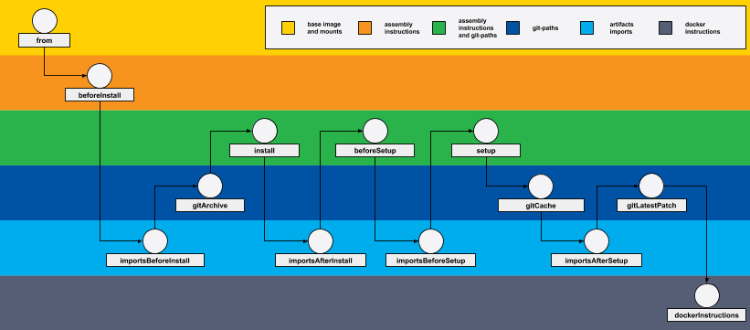

Мы предлагаем разделить сборочный процесс на этапы, каждый с четкими функциями и своим назначением. Каждый такой этап соответствует промежуточному образу, подобно слоям в Docker. В werf такой этап называется [стадией](#стадии), и конечный [образ](#образы) в итоге состоит из набора собранных стадий. Все стадии хранятся в [хранилище стадий](#хранилище-стадий), которое можно рассматривать как кэш сборки приложения, хотя по сути это скорее часть контекста сборки.

## Стадии

Стадии — это этапы сборочного процесса, кирпичи, из которых в итоге собирается конечный образ.
***Стадия*** собирается из группы сборочных инструкций, указанных в конфигурации. Причем группировка этих инструкций не случайна, имеет определенную логику и учитывает условия и правила сборки. С каждой _стадией_ связан конкретный Docker-образ.

Сборочный процесс werf подразумевает последовательную сборку стадий с использованием _конвейера стадий_. _Конвейер стадий_ — набор условий и правил выполнения стадий, подразумевающий также четко определенный порядок выполнения стадий. werf использует не один, а несколько _конвейеров стадий_ в своей работе, по-разному собирая образы в зависимости от их описанной конфигурации.

<div class="tabs">
  <a href="javascript:void(0)" class="tabs__btn active" onclick="openTab(event, 'tabs__btn', 'tabs__content', 'dockerfile-image-tab')">Dockerfile-образ</a>
  <a href="javascript:void(0)" class="tabs__btn" onclick="openTab(event, 'tabs__btn', 'tabs__content', 'stapel-image-tab')">Stapel-образ</a>
  <a href="javascript:void(0)" class="tabs__btn" onclick="openTab(event, 'tabs__btn', 'tabs__content', 'stapel-artifact-tab')">Stapel-артефакт</a>
</div>

<div id="dockerfile-image-tab" class="tabs__content active">
<a class="google-drawings" href="../../images/reference/stages_and_images1.png" data-featherlight="image">

</a>
</div>

<div id="stapel-image-tab" class="tabs__content">
<a class="google-drawings" href="../../images/reference/stages_and_images2.png" data-featherlight="image">

</a>
</div>

<div id="stapel-artifact-tab" class="tabs__content">
<a class="google-drawings" href="../../images/reference/stages_and_images3.png" data-featherlight="image">

</a>
</div>

**Пользователю нужно только написать правильную конфигурацию, остальная работа со стадиями выполняется werf.**

При каждой сборке, для каждой _стадии_, werf подсчитывает уникальный сборочный идентификатор — _сигнатуру стадии_.
Сборка каждой _стадии_ выполняется в ***сборочном контейнере***, который основан на предыдущей стадии согласно _конвейеру стадий_. После завершения работы сборочного контейнера, стадия сохраняется в [хранилище стадий](#хранилище-стадий).

_Сигнатура стадии_ используется для [тегирования](#именование-стадий) _стадии_ (сигнатура является только частью тега) в _хранилище стадий_.
werf не собирает стадию, если стадия с такой _сигнатурой_ уже находится в _хранилище стадий_ (это поведение похоже на кэширование в Docker, только имеет более сложную логику).

***Сигнатура стадии*** — это контрольная сумма от:
 - контрольной суммы [зависимостей стадии]({{ site.baseurl }}/documentation/reference/stages_and_images.html#зависимости-стадии).
 - сигнатуры предыдущей стадии;
 - идентификатора git коммита связанного с предыдущей стадией (если эта стадия связана с git).

_Сигнатура_ стадии идентифицирует содержимое стадии и зависит от истории правок в git, которые привели к этому коммиту. Может существовать несколько собранных образов с одинаковой сигнатурой. Стадии, собранные для разных git-веток могут иметь одинаковую сигнатуру, но werf не допустит переиспользование кеша связанного с разными git-ветками, подробнее [в разделе алгоритм выборки стадий]({{ site.baseurl }}/documentation/reference/stages_and_images.html#выборка-стадий).

В случае отсутствия у стадии _зависимостей стадии_, она пропускается, и, соответственно, _конвейер стадий_ уменьшается на одну стадию. Таким образом конвейер стадий может уменьшаться на несколько стадий, вплоть до единственной стадии _from_.

<a class="google-drawings" href="../../images/reference/stages_and_images4.png" data-featherlight="image">

</a>

## Зависимости стадии

_Зависимости стадии_ — это данные, которые напрямую связаны и влияют на _сигнатуру стадии_. К зависимостям стадии относятся:

 - файлы (и их содержимое) из git-репозиториев;
 - инструкции сборки стадии из файла `werf.yaml`;
 - произвольные строки указанные пользователем в `werf.yaml`
 - и т.п.

Большинство _зависимостей стадии_ определяется в файле конфигурации `werf.yaml`, остальные — во время запуска.

Следующая таблица иллюстрирует зависимости в Dockerfile-образе, Stapel-образе и [Stapel-артефакте]({{ site.baseurl }}/documentation/configuration/stapel_artifact.html).
Каждая строка таблицы описывает зависимости для определенной стадии. Левая колонка содержит краткое описание зависимостей, правая содержит соответствующую часть `werf.yaml` и ссылки на разделы с более подробной информацией.

<div class="tabs">
  <a href="javascript:void(0)" id="image-from-dockerfile-dependencies" class="tabs__btn dependencies-btn active">Dockerfile-образ</a>
  <a href="javascript:void(0)" id="image-dependencies" class="tabs__btn dependencies-btn">Stapel-образ</a>
  <a href="javascript:void(0)" id="artifact-dependencies" class="tabs__btn dependencies-btn">Stapel-артефакт</a>
</div>

<div id="dependencies">

<div class="stage {{stage.type}}">
  <div class="stage-body">
    <div class="stage-base">
      <p>stage {{ stage.name | escape }}</p>

      
      <div class="dependencies">
        
        <div class="dependency">
          {{ dependency | escape }}
        </div>
        
      </div>
      
    </div>

<div class="werf-config" markdown="1">


```yaml
{{ stage.werf_config }}
```



<div class="references">
    Подробнее:
    <ul>
    
        <li><a href="{{ reference.link }}">{{ reference.name }}</a></li>
    
    </ul>
</div>


</div>

    </div>
</div>

</div>


<script src="https://cdnjs.cloudflare.com/ajax/libs/jquery/3.4.1/jquery.min.js"></script>
<script>
function application() {
  if ($("a[id=image-from-dockerfile-dependencies]").hasClass('active')) {
    $(".image").addClass('hidden');
    $(".artifact").addClass('hidden');
    $(".image-from-dockerfile").removeClass('hidden')
  }
  else if ($("a[id=image-dependencies]").hasClass('active')) {
    $(".image-from-dockerfile").addClass('hidden');
    $(".artifact").addClass('hidden');
    $(".image").removeClass('hidden')
  }
  else if ($("a[id=artifact-dependencies]").hasClass('active')) {
    $(".image-from-dockerfile").addClass('hidden');
    $(".image").addClass('hidden');
    $(".artifact").removeClass('hidden')
  }
  else {
    $(".image-from-dockerfile").addClass('hidden');
    $(".image").addClass('hidden');
    $(".artifact").addClass('hidden')
  }
}

$('.tabs').on('click', '.dependencies-btn', function() {
  $(this).toggleClass('active').siblings().removeClass('active');
  application()
});

application();
$.noConflict();
</script>

## Хранилище стадий

_Хранилище стадий_ содержит стадии проекта. Стадии могут храниться локально на хост-машине, либо в Docker Repo.

Большинство команд werf используют _стадии_. Такие команды требуют указания места размещения _хранилища стадий_ с помощью ключа `--stages-storage` или переменной окружения `WERF_STAGES_STORAGE`.

Существует 2 типа хранилища стадий:
 1. _Локальное хранилище стадий_. Использует локальный docker-server для хранения docker-образов соответствующих стадий. Включается опцией `--stages-storage=:local`. Данный режим был единственным поддерживаемым до версии [v1.1.10](https://github.com/werf/werf/releases/tag/v1.1.10).
 2. _Удалённое хранилище стадий_. Использует docker registry для хранения стадий. Включается опцией `--stages-storage=DOCKER_REPO_DOMAIN`, например `--stages-storage=registry.mycompany.com/web/frontend/stages`. **ЗАМЕЧАНИЕ** Каждый проект должен использовать в качестве хранилища стадий уникальный адрес docker repo, который используется только этим проектом.

Стадии будут [именоваться по-разному](#именование-стадий) в зависимости от типа используемого хранилища стадий.

При использовании docker registry для хранения стадий, локальный docker-server на всех хостах, где запускают werf, используется как кеш. Этот кеш может быть очищен автоматически самим werf-ом, либо удалён с помощью других инструментов (например `docker rmi`).

Рекомендуется использовать docker registry в качестве хранилища стадий. Werf по умолчанию использует этот режим [при работе в CI/CD системах]({{ site.baseurl }}/documentation/reference/plugging_into_cicd/overview.html).

Требования к хостам при использовании удалённого хранилища стадий:
 - Доступ к docker registry.
 - Доступ к кластеру Kubernetes (используется для синхронизации нескольких процессов сборки, публикации и выката с разных хостов).

Заметим, что все команды werf, которые требуют доступа к стадиям должны использовать одно и то же хранилище стадий. Поэтому при использовании локального хранилища стадий все команды werf должны запускаться с одного и того же хоста. При использовании удалённого хранилища стадий не важно с какого хоста запускается werf если для этих вызовов указан одинако (касается таких команд как build, publish, cleanup, deploy и т.д.)

### Именование стадий

Стадии в _локальном хранилище стадий_ именуются согласно следующей схемы: `werf-stages-storage/PROJECT_NAME:SIGNATURE-TIMESTAMP_MILLISEC`. Например:

```
werf-stages-storage/myproject                   9f3a82975136d66d04ebcb9ce90b14428077099417b6c170e2ef2fef-1589786063772   274bd7e41dd9        16 seconds ago      65.4MB
werf-stages-storage/myproject                   7a29ff1ba40e2f601d1f9ead88214d4429835c43a0efd440e052e068-1589786061907   e455d998a06e        18 seconds ago      65.4MB
werf-stages-storage/myproject                   878f70c2034f41558e2e13f9d4e7d3c6127cdbee515812a44fef61b6-1589786056879   771f2c139561        23 seconds ago      65.4MB
werf-stages-storage/myproject                   5e4cb0dcd255ac2963ec0905df3c8c8a9be64bbdfa57467aabeaeb91-1589786050923   699770c600e6        29 seconds ago      65.4MB
werf-stages-storage/myproject                   14df0fe44a98f492b7b085055f6bc82ffc7a4fb55cd97d30331f0a93-1589786048987   54d5e60e052e        31 seconds ago      64.2MB
```

Стадии в _удалённом хранилище стадий_ именуются согласно следующей схемы: `DOCKER_REPO_ADDRESS:SIGNATURE-TIMESTAMP_MILLISEC`. Например:

```
localhost:5000/myproject-stages                 d4bf3e71015d1e757a8481536eeabda98f51f1891d68b539cc50753a-1589714365467   7c834f0ff026        20 hours ago        66.7MB
localhost:5000/myproject-stages                 e6073b8f03231e122fa3b7d3294ff69a5060c332c4395e7d0b3231e3-1589714362300   2fc39536332d        20 hours ago        66.7MB
localhost:5000/myproject-stages                 20dcf519ff499da126ada17dbc1e09f98dd1d9aecb85a7fd917ccc96-1589714359522   f9815cec0867        20 hours ago        65.4MB
localhost:5000/myproject-stages                 1dbdae9cc1c9d5d8d3721e32be5ed5542199def38ff6e28270581cdc-1589714352200   6a37070d1b46        20 hours ago        65.4MB
localhost:5000/myproject-stages                 f88cb5a1c353a8aed65d7ad797859b39d357b49a802a671d881bd3b6-1589714347985   5295f82d8796        20 hours ago        65.4MB
localhost:5000/myproject-stages                 796e905d0cc975e718b3f8b3ea0199ea4d52668ecc12c4dbf85a136d-1589714344546   a02ec3540da5        20 hours ago        64.2MB
```

 - `PROJECT_NAME` — имя проекта;
 - `STAGE_SIGNATURE` — сигнатура стадии. Сигнатура является идентификатором содержимого стадии и также зависит от истории правок в git репозитории, которые привели к такому содержимому.
 - `TIMESTAMP_MILLISEC` — уникальный идентификатор, который генерируется в процессе [процедуры сохранения стадии](#сборка-и-сохранение-стадий) после того как стадия была собрана.

### Выборка стадий

Алгоритм выборки стадий в werf основан на проверке родства git-коммитов:

 1. Рассчитывается сигнатуры некоторой стадии.
 2. Возможно существование нескольких стадий в хранилище стадий с одной и той же сигнатурой, поэтому на данном этапе происходит выборка всех стадий, подходящих по целевой сигнатуре.
 3. Если текущая стадия связана с git (стадия git-архив, пользовательская стадия с git-патчами или стадия git latest patch), тогда выбираются только те стадии, которые связаны с коммитами, являющимися предками текущего коммита. Таким образом коммиты соседних веток будут отброшены.
 4. Среди оставшихся образов выбирается старейший по времени `TIMESTAMP_MILLISEC`.

Возможна ситуация когда существует несколько собранных образов с одинаковой сигнатурой. Более того, стадии для разных git-веток могут иметь одинаковую сигнатуру. Однако werf гарантированно предотвращает переиспользование кеша между несвязанными ветками. Кеш в разных ветках может быть переиспользован только если этот кеш относится к коммиту, который является базовым как для одной ветки, так и для другой.

### Сборка и сохранение стадий

Если в процессе выборки стадий не было найдено подходящей стадии по целевой сигнатуре, тогда werf инициирует сборку нового образа для данной стадии.

Следует отметить, что множество процессов werf (на одном хосте или на нескольких хостах) могут инициировать сборку одной и той же стадии в один момент времени, потому что этой стадии еще нету в хранилище стадий. Werf использует алгоритм оптимистичных блокировок в процессе сохранения свежесобранного образа в хранилище стадий: когда сборка нового образа закончена werf блокирует хранилище стадий на любые операции с целевой сигнатурой и сохраняет свежесобранный образ в хранилище стадий, но только при условии, что в момент сохранения в нем уже нету подходящих стадий по нашей сигнатуре. Новые стадии могли появится в процессе сборки. В случае если уже существующий образ был найден, свежесобранный образ будет отброшен, вместо него в качестве кеша будет взят уже существующий образ. Если же за время сборки подходящих образов в хранилище стадий не появилось, то werf сохранит новый образ, сгенерировав гарантированно уникальный идентификатор `TIMESTAMP_MILLISEC`.

Другими словами: первый процесс, который закончит сборку новой стадии (самый быстрый процесс) получит шанс сохранить собранный образ в хранилище стадий. Таким образом медленный процесс сборки не будет блокировать более быстрые процессы в параллельной и распределенной среде.

В процессе выборки и сохранения новых стадий в хранилище стадий werf использует [менеджер блокировок](#синхронизация-блокировки-и-кеш-хранилища-стадий) для координации работы нескольких процессов werf.

### Сигнатура стадий образа

_Сигнатура стадий_ образа — это такая сигнатура, которая идентифицирует содержимое всего образа и зависит от истории правок в git репозитории, которые привели к такому содержимому.

***Сигнатура стадий*** рассчитывается аналогичным образом как и сигнатура обыкновенных стадий образа как контрольная сумма от:
 - сигнатуры последней не пустой стадии образа;
 - идентификатора git коммита связанного с последней не пустой стадией образа (если эта стадия связана с git).

Данная сигнатура используется [при тегировании образов по содержимому]({{ site.baseurl }}/documentation/reference/publish_process.html#тегирование-образов-по-содержимому) и для импорта файлов из артефактов и образов (сигнатура стадий артефакта или образа влияет на сигнатуру стадии импортов целевого образа, куда происходит импорт).

## Образы

_Образ_ — это **готовый к использованию** Docker-образ, относящийся к опеределенному состоянию приложения в соответствии со [стратегией тегирования]({{ site.baseurl }}/documentation/reference/publish_process.html).

Как было написано [выше](#стадии), _стадии_ — это этапы сборочного процесса, кирпичи, из которых в итоге собирается конечный _образ_.
_Стадии_, в отличие от конечных _образов_ не предназначены для прямого использования. Основное отличие между конечными образами и стадиями — разное поведение [политики очистки]({{ site.baseurl }}/documentation/reference/cleaning_process.html#очистка-по-политикам) по отношению к ним, я также различия в структуре хранимой мета-информации.
Очистка _хранилища стадий_ основана только на наличии в _репозитории образов_ связанных с соответствующими стадиями образов.

werf создает _образы_ используя _хранилище стадий_.
На текущий момент, _образы_ создаются только в [_процессе публикации_]({{ site.baseurl }}/documentation/reference/publish_process.html) (publish) и хранятся в _репозитории образов_.

Конфигурация образов должна быть описана в файле конфигурации `werf.yaml`.

В процессе выборки и сохранения новых стадий в хранилище стадий werf использует [менеджер блокировок](#синхронизация-блокировки-и-кеш-хранилища-стадий) для координации работы нескольких процессов werf. Лишь один процесс werf может производить процедуру публикации одного и того же образа в один момент времени.

## Синхронизация: блокировки и кеш хранилища стадий

Синхронизация — это группа сервисных компонентов werf, предназначенных для координации нескольких процессов werf при выборке и сохранении стадий в хранилище стадий, а также при публикации образов в репозиторий образов. Существует 2 таких компонента для синхронизации:

 1. _Кеш хранилища стадий_ — это внутренний служебный кеш werf, который существенно повышает производительность фазы рассчёта стадий в случае, если эти стадии уже есть в хранилище. Кеш хранилища стадий содержит соответствие существующих в хранилище стадий с сигнатурой (или другими словами: содержит предварительно расчитанный шаг алгоритма выборки стадий по сигнатуре). Данный кеш является когерентным и werf автоматически сбрасывает его, если будет замечена несостыковка между хранилищем стадий и кешом хранилища стадий.
 2. _Менеджер блокировок_. Блокировки требуются для корректной публикации новых стадий в хранилище, публикации новых образов в репозиторий образов и для организации параллельных процессов выката в Kubernetes (блокируется имя релиза).

Все команды, использующие параметры хралищища стадий (`--stages-storage=...`) и репозитория образов (`--images-repo=...`) также требуют указания адреса менеджера блокировок, который задается опцией `--syncrhonization=...` или переменной окружения `WERF_SYNCHRONIZATION=...`.
На данный момент поддерживается только локальный менеджер блокировок (соответствущее значение опции: `--syncrhonization=:local`).

Существует 2 типа наборов компонентов для синхронизации:
 1. Локальный. Включается опцией `--synchronization=:local`.
   - Локальный _кеш хранилища стадий_ располагается по умолчанию в файлах `~/.werf/shared_context/storage/stages_storage_cache/1/PROJECT_NAME/SIGNATURE`, каждый из которых хранит соответствие существующих в хранилище стадий по некоторой сигнатуре.
   - Локальный _менеджер блокировок_ использует файловые блокировки, предоставляемые операционной системой.
 2. Kubernetes. включается опцией `--synchronization=kubernetes://NAMESPACE`.
  - _Кеш хранилища стадий_ в Kubernetes использует для каждого проекта отдельный ConfigMap `cm/PROJECT_NAME`, который создается в указанном `NAMESPACE`.
  - _Менеджер блокировок_ в Kubernetes использует ConfigMap по имени проекта `cm/PROJECT_NAME` (тот же самый что и для кеша хранилища стадий) для хранения распределённых блокировок в аннотациях этого ConfigMap. Werf использует [библиотека lockgate](https://github.com/werf/lockgate), которая реализует распределённые блокировки с помощью обновления аннотаций в ресурсах Kubernetes.

Werf использует `--synchronization=:local` (локальный _кеш хранилища стадий_ и локальный _менеджер блокировок_) по умолчанию, если используется локальное хранилище стадий (`--stages-storage=:local`).

Werf использует `--synchronization=kubernetes://werf-synchronization` (_кеш хранилища стадий в kubernetes_ и _менеджер блокировок в kubernetes_) по умолчанию, если используется удалённое хранилище стадий (`--stages-storage=DOCKER_REPO_ADDRESS`). Блокировки и кеш каждого проекта будут хранится в ConfigMap по имени проекта `cm/PROJECT_NAME` в общем namespace `werf-synchronization`.

Пользователь может принудительно указать произвольный адрес компонентов для синхронизации, если это необходимо, с помощью явного указания опции `--syncrhonization=:local|kubernetes://NAMESPACE` (может быть указан любой namespace, `werf-synchronization` — это namespace по умолчанию).

**ЗАМЕЧАНИЕ:** Множество процессов werf, работающих с одним и тем же проектом обязаны использовать одинаковое хранилище стадий и адрес набора компонентов синхронизации.

## Работа со стадиями

### Команда sync

`werf stages sync --from=:local|REPO --to=:local|REPO`

 - Команда скопирует только те стадии, которых не хватает в `--to` из `--from`.
 - Команда копирует сразу несколько стадий в параллельном режиме.
 - Результат вызова команды идемпотентен: sync может быть вызыван много раз, прерван, вызван опять — результат будет одинаковым. Стадии, которые уже синхронизированы не будут копироваться заново.
 - Есть пара опций для удаления стадий во время копирования: `--remove-source` и `--cleanup-local-cache`, которые контролируют будет ли werf удалять стадию из хранилища, которая синхронизировалась с целевым хранилищем, и будет ли werf очищать хост от временных docker-образов, которые могли образоваться при копировании стадий между хранилищами.
 - Команда может использоваться, чтобы скачать стадии проекта на локальный хост для разработки, или для создания backup-ов, или для переезда проекта на другой docker-registry и т.п.

### Команда switch-from-local

`werf stages switch-from-local --to=REPO`

 - Команда автоматически производит [синхронизацию существующих стадий](#команда-sync) из `:local` в указанное хранилище стадий `REPO`.
 - Команда установит блокировку на проект, предотвращающую использование `:local` в качестве хранилища стадий.
   - Это означает, что после завершения команды switch-from-local, любая команда werf, которая использует параметр `--stages-storage=:local`, будет завершаться с ошибкой. Тем самым предотвращается нарушение целостности сборки из-за использования разных хранилищ стадий одновременно.
   - Блокировка будет установлена на проект после процедуры автоматической синхронизации существующих стадий, которая встроена в команду switch-from-local.

См. также статью про [переключение на распределённый режим работы]({{ site.baseurl }}/documentation/guides/switch_to_distributed_mode.html).

## Дальнейшее руководство

Больше информации о процессе сборки для stapel и Dockerfile сборщиков [доступно в статье]({{ site.baseurl }}/documentation/reference/build_process.html).
